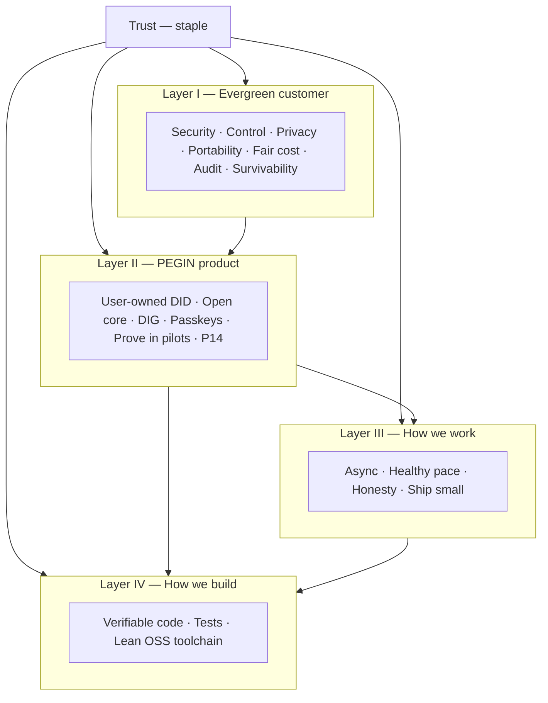

# PEGIN manifest — principles that anchor everything

> **PEGIN** — Penguin Gateway Identity. Decentralized SSO and permission management on Chia + DIG.

This document is the **single anchor** for why PEGIN exists, what we promise customers forever, how we build, and how we work. Deeper stories live in linked docs; when they disagree, **this manifest wins** until we explicitly revise it.

**Trust** is the staple of the **PEGIN foundation** and **PEGIN company**: everything below exists to earn it, keep it, and make it verifiable — not to spend it on hype.

| Layer | Question it answers | Detail docs |
|-------|---------------------|-------------|
| **I — Evergreen customer** | What do buyers and users always want from identity? | [core-value-user-owned-login.md](core-value-user-owned-login.md) |
| **II — PEGIN product** | What is unique and non-negotiable about our protocol? | [fully-decentralized.md](fully-decentralized.md) · [business-principles.md](business-principles.md) |
| **III — How we work** | How do contributors collaborate? | [how-we-work.md](../09-how-we-work/how-we-work.md) |
| **IV — How we build** | How do we write and test code? | [linting-and-formatting.md](../08-developer/engineering/linting-and-formatting.md) · [test-architecture.md](../08-developer/engineering/test-architecture.md) |

---

## North star

**Identity should belong to the person, not to the employer’s directory.**

Employers grant **permission**; they do not own the human. The protocol should still work if PEGIN Inc., any single operator, or any single country’s cloud policy disappears.

**And trust should belong to the user and the buyer — not to a vendor’s marketing deck.**

---

## Trust — the staple (foundation & company)

Identity systems fail when **trust** fails: users stop enrolling, CISOs block rollout, contributors leave, regulators dig in. PEGIN treats trust as **infrastructure**, not a brand adjective.

### Three kinds of trust we owe

| Who | What “trust” means | How we earn it |
|-----|-------------------|----------------|
| **Users** | “My login is mine; my employer can’t erase me or sell my trail.” | User-owned DID, passkeys, minimization (E3–E4, P1–P2) |
| **Enterprises & regulators** | “I can deploy this in my jurisdiction, audit it, and exit without hostage.” | Open core, DIG + anchors, prove-in-pilot honesty (E8–E11, P4–P6, P12) |
| **The public & contributors** | “This team and protocol do what they say; they don’t burn trust for growth.” | Manifest, open docs, aligned incentives, no toxic urgency (P10–P11, W5–W10, B5) |

### What trust is made of (PEGIN)

| Pillar | Commitment |
|--------|------------|
| **Verifiable** | Claims tie to cryptography, pilots, or published specs — not vibes |
| **Transparent** | Open source, open docs, clear v1 boundaries (what we do *not* ship) |
| **Dispensable** | Protocol and data survive company drama (P11) — trust does not require believing in us forever |
| **Honest** | No fake metrics, customers, or ROI; evidence policy in [CONTEXT.md](../ai/CONTEXT.md) |
| **Human** | Sustainable team (W5–W10) so security and protocol work are not built exhausted |

### What burns trust (never)

- Surveillance SSO dressed as “security”  
- Unvalidated savings or compliance claims in sales  
- Hidden control planes or data harvesting  
- Heroics, crunch, and “ASAP” culture that produces bad auth code  
- Closing source, trapping data, or changing rules after adoption without migration path  

### Foundation vs company

| | **PEGIN foundation / protocol** | **PEGIN company (operator)** |
|---|--------------------------------|------------------------------|
| **Role** | Steward open specs, manifests, and long-term protocol truth | Ship product, pilots, support, optional SLA |
| **Trust job** | Stay neutral, forkable, and honest about scope | Operate reliably without becoming the single point of betrayal |
| **Failure mode** | Protocol capture or dishonest docs | Vendor lock-in, data grab, or hype over proof |

Both share this manifest. **If company behavior contradicts protocol principles, protocol principles win** until the manifest is deliberately revised in public.

---

## Layer I — Evergreen customer principles

These are **timeless**. They held true before Okta, hold true with Entra, and will hold true after the next rebranding. PEGIN exists to serve them better than seat-license SaaS alone can.

| # | Principle | What customers always want | PEGIN direction |
|---|-----------|--------------------------|-----------------|
| E1 | **Security they can trust** | Strong authentication, fast revocation, no silent backdoors | Passkeys (FIDO2); PePP revoke on DIG; audit on DIG with chain anchors |
| E2 | **Control** | Know who can access what, and change it quickly | App-level grants; manager approve on phone (PePP); not only static AD groups |
| E3 | **Privacy & minimization** | Collect only what access requires | Prove identity without owning browsing history; employer sees auth, not every URL |
| E4 | **Portability** | Identity and proof of work survive job changes | User-held DID; credentials in wallet; employer revokes permission, not person |
| E5 | **Fair economics** | Predictable cost; exit without hostage | Open core; no default per-seat tax; forkable protocol |
| E6 | **Reliability** | Login works when needed | Design for HA operators + DIG replication — **prove in SLOs** |
| E7 | **Speed** | Access requests and login feel instant | Sub-second login target; minutes not days for grants — **measure in pilots** |
| E8 | **Honesty** | Vendor claims match reality | No fake ROI; pilots before market numbers |
| E9 | **Sovereignty** | Data and keys under chosen law/jurisdiction | EU and regulated buyers: deploy DIG peers locally ([competitive-moat.md](../05-business/competitive-moat.md)) |
| E10 | **Auditability** | Prove who had access, when, and that records weren’t tampered with | Append-only DIG audit; verifiable store commitments on Chia |
| E11 | **Survivability** | System outlives vendor drama | Protocol + open source; immutable anchors; replicated DIG |

**Customers do not buy “blockchain.”** They buy **trust** expressed as E1–E11. Chain and DIG are how we deliver that trust honestly.

---

## Layer II — PEGIN product principles

These are **PEGIN’s** commitments. They stay stable across roadmap phases; features come and go, principles do not.

### Identity & trust

| # | Principle | Meaning |
|---|-----------|---------|
| P1 | **User-owned root** | DID in user device; employer adds revocable permission |
| P2 | **Passkey-first, chain-invisible** | **One button**, no redirect, instant if session valid; no crypto/PEGIN noise; one-tap Face ID if expired |
| P3 | **Protocol over company** | PEGIN is infrastructure, not a rent-seeking directory |
| P4 | **Open core** | Source forkable; survival does not require one vendor |
| P5 | **Decentralized data** | Profiles, grants, audit on **DIG** — not one hidden Postgres |
| P6 | **Light chain, heavy off-chain** | Chia anchors and protocol state only; no bulk personal data on chain |

### Permissions & enterprise

| # | Principle | Meaning |
|---|-----------|---------|
| P7 | **Capabilities, not role soup** | Time-bound, app-scoped grants (PePP) vs hundreds of AD groups |
| P8 | **Revoke that sticks** | Update DIG; apps deny on next check — prove in offboarding drills |
| P9 | **Standards when enterprises need them** | OIDC, SAML, SCIM — companies integrate like any IdP; users still see only passkey login |

### Business & ecosystem

| # | Principle | Meaning |
|---|-----------|---------|
| P10 | **Aligned incentives** | We win when the network is useful, not when we trap seats |
| P11 | **Dispensable operator** | Founder or company exit must not delete user identity |
| P12 | **Prove before proclaim** | TCO, speed, compliance claims only with named pilots |
| P13 | **Ship the epicenter first** | “Login with PEGIN” before Entra parity fantasies |
| P14 | **Trust is the product** | Features prove trust; marketing only names what pilots already showed |

### What we refuse to become

- A per-seat IdP that harvests user behaviour for ads or ML  
- A single mandatory control plane customers cannot run themselves  
- A slide deck without a working passkey + DID path  
- A blockchain project that puts audit payloads on chain for show  

---

## Foundation & company mottos

Short phrases for **PEGIN foundation** and **PEGIN company** contributors. They are culture shorthand for [trust](#trust--the-staple-foundation--company) and [Layer III](#layer-iii--how-we-work) — memorable, serious, and enforced by behavior not posters.

| Motto | What it means in practice |
|-------|---------------------------|
| **Don’t be an asshole!** | Disagree in writing; no bullying, contempt, or public humiliation. Critique work, not people. |
| **No drama allowed!** | No gossip chains, faction wars, or passive-aggressive pings. Escalate facts in GitHub/Basecamp or drop it. |
| **Your ego is not your amigo!** | The manifest and pilots outrank anyone’s need to be right. Ship the epicenter; admit when wrong. |
| **Meeting free zone!** | Default async. Internal meetings are rare, time-boxed, and need a written reason (W2). |
| **Library Zone Days** | Team focus day(s): no internal meetings, deep work — maps to **library days** (W4). |
| **Keep quiet — someone is working.** | Protect maker time; batch questions; no “quick call?” culture; notifications off on library days (W7). |

These mottos apply to **every role** (product, business, engineering, ops). Customer calls and real incidents are not an excuse for internal drama or meeting creep.

Detail: [how-we-work.md](../09-how-we-work/how-we-work.md).

---

## Layer III — How we work

Culture follows product: **decentralized systems deserve decentralized collaboration.** The [mottos](#foundation--company-mottos) above are how we say it out loud.

| # | Principle | Practice |
|---|-----------|----------|
| W1 | **Write first** | Specs and PRs before meetings |
| W2 | **No meeting culture** | Default async; meetings rare and time-boxed |
| W3 | **Remote by default** | Distributed team; outcomes over presence |
| W4 | **Library days** | Weekly focus day — deep work, no internal meetings |
| W5 | **Sustainable pace** | No heroics; overtime = planning failure; incidents excepted |
| W6 | **Small batches** | POC → v1 → PePP; planning is direction not prophecy |
| W7 | **Interrupt the urgent-only** | Maker time protected |
| W8 | **Healthy mindset** | Sleep and time off are inputs to quality; no glorifying exhaustion (*Rework*) |
| W9 | **No toxic urgency** | Specific deadlines, not “ASAP” culture |
| W10 | **Say no** | Protect the team by refusing scope and meeting creep |
| W11 | **Trust through transparency** | Write decisions in GitHub; no surprise pivots; credit pilots honestly |

Inspired by [*Rework*](https://37signals.com/books/rework) (Fried & Heinemeier Hansson). Full detail: [how-we-work.md](../09-how-we-work/how-we-work.md) (collaboration + **healthy team mindset**).

---

## Layer IV — How we build

| # | Principle | Practice |
|---|-----------|----------|
| B1 | **Readable code** | Pragmatic [*Clean Code*](https://www.pearson.com/en-us/subject-catalog/p/clean-code-a-handbook-of-agile-software-craftsmanship/P200000003285) — names, small functions, clear errors |
| B2 | **Tests early, TDD optional** | Simulator wallets and pyramid from day one |
| B3 | **Layered architecture** | Domain inside; Chia/DIG/SQL at the edge ([application-architecture.md](../10-architecture/application-architecture.md)) |
| B4 | **Fast CI** | Unit and integration on every PR; e2e on main/nightly |
| B5 | **Lean toolchain** | Paid SaaS: GitHub + Basecamp only; OSS elsewhere; host on DIG (Hetzner for early POC); Podman/Docker dev when code lands |
| B6 | **Build verifiably** | Tests, audit trails, crypto review; AI and cloud tools follow [ai-coding-tools.md](../08-developer/environment/ai-coding-tools.md) — no trust leaks via prompts |

Layer III: [09-how-we-work/](../09-how-we-work/team-how-we-work.md) · Layer IV (code): [infrastructure-and-tooling-principles.md](../08-developer/environment/infrastructure-and-tooling-principles.md) · [developer-environment.md](../08-developer/environment/developer-environment.md) · [linting-and-formatting.md](../08-developer/engineering/linting-and-formatting.md) · [test-architecture.md](../08-developer/engineering/test-architecture.md).

---

## How the layers fit together

**Decision test:** For any feature, strategy, hire, or public claim, ask:

0. **Does this earn or burn trust** for users, enterprises, or the public? If it burns trust, stop.  
1. Which evergreen principle (E1–E11) does this serve?  
2. Does it strengthen a PEGIN principle (P1–P14), especially **trust is the product** (P14)?  
3. Does it respect how we work (W1–W11), including healthy pace and transparency?  
4. Can we build and prove it (B1–B6)?  

If (0) or (1) is unclear, stop.

---

## One-page summary (for wiki, pitches, onboarding)

**Staple:** **Trust** — verifiable, transparent, dispensable, honest. Foundation and company share one manifest.

**For users:** Your login is yours. Employers grant access; they cannot erase you.

**For enterprises:** Passwordless SSO and fast permissions you can **audit and deploy** in your jurisdiction — without mandatory US SaaS lock-in; proof from pilots, not slides.

**For contributors:** Open protocol, async healthy team, ship proof not hype. Culture: *Don’t be an asshole · No drama · Ego is not your amigo · Meeting-free · Library Zone Days · Keep quiet — someone is working.*

**For skeptics:** We publish principles first; we earn trust with cryptography, open source, and named pilots — not ARR fiction.

---

## Governance of this document

- **Owner:** Vision / product leadership (community governance later if applicable).  
- **Change:** Revise via PR with explicit “manifest change” label and short rationale.  
- **Wiki:** [PEGIN_Wiki.md § Core Philosophy](../wiki/PEGIN_Wiki.md#2-core-philosophy) summarizes; does not override this file.  
- **AI agents:** Load this file + [CONTEXT.md](../ai/CONTEXT.md) before strategy or product answers.

---

## Related reading

| Audience | Start here |
|----------|------------|
| Everyone | This manifest |
| Users & buyers | [core-value-user-owned-login.md](core-value-user-owned-login.md) |
| Enterprise / EU | [competitive-moat.md](../05-business/competitive-moat.md) |
| Everyone (culture) | [09-how-we-work/team-how-we-work.md](../09-how-we-work/team-how-we-work.md) |
| Everyone (system) | [10-architecture/architecture-overview.md](../10-architecture/architecture-overview.md) |
| Programmers | [08-developer/developer-documentation.md](../08-developer/developer-documentation.md) · [04-technical/specs/](../04-technical/specs/specifications-index.md) |
| Business depth | [business-principles.md](business-principles.md) · [sustainable-funding.md](../05-business/sustainable-funding.md) |
| Full narrative wiki | [PEGIN_Wiki.md](../wiki/PEGIN_Wiki.md) |

*Manifest v1.3 · May 2026 · Trust is the staple; foundation & company mottos; Layers I–IV*
