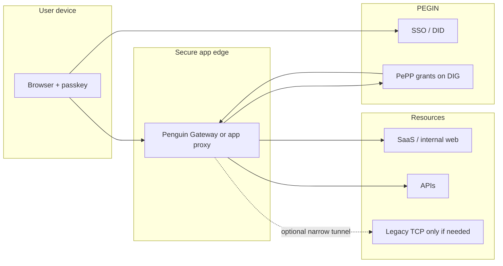

# PEGIN Permission Platform (PePP) — Decentralized Access Control

> **Phase:** [Phase 2 in roadmap](../03-use-cases/roadmap.md) — not part of POC.

## What PePP is

**PePP** (PEGIN Permission Platform) is the access-control layer that sits on top of [PEGIN SSO](../08-developer/README.md): who may reach which app, API, or internal resource, for how long, under what conditions — with revocation that actually sticks.

Enterprises often bought **Citrix** (and a corporate **VPN**) to solve two different problems with one heavy stack:

1. **Reach** — “Let remote employees get onto the network or into published apps.”
2. **Governance** — “Only the right people get the right access, and we can prove it.”

Citrix is mediocre at both, and terrible at (2). PePP is built for (2). Combined with **identity-bound app access** (browser-first, no Citrix Receiver for SaaS and modern web apps), it can **retire most of the Citrix + full-tunnel VPN footprint** for teams that mainly need “open this internal tool safely,” not “stream a Windows desktop.”

**Direction:** Mobile approve/deny, grants on DIG, apps re-check on every session — target approval in **minutes**, offboarding revocation in **seconds**. Validate timelines in design partners; do not publish generic savings claims until measured.

---

## Part 1: Why Citrix + Active Directory is broken

### The Current Architecture (Painful)

```
Employee Request Active Directory Citrix Integration Application
 │ │ │ │
 │─ "I need app access"─→ │ │ │
 │ │─ Update security groups─→ │ │
 │ │ │─ Sync metadata─→ │
 │ │ (wait 2-4 hours) │ │
 │ │ │─ Flush caches─→ │
 │ │ │ │
 │◀─── Access Granted ────────────────────────────────│◀──────────────────│
 │ (3-7 days)
```

### The Pain Points

| Problem | Impact | Time Waste |
|---|---|---|
| **Manual approval chains** | Request bounces between 3-5 people | 2-3 days |
| **AD security group sync** | Changes replicate every 4 hours (sometimes fail) | 4-8 hours |
| **Citrix metadata refresh** | Requires manual cache flush, sometimes restart | 1-2 hours |
| **Legacy app integration** | Many apps don't talk to AD (manual LDAP/custom connectors) | 1-2 days per app |
| **Citrix policy evaluation** | Complex rules take 30 seconds per login (visible to user) | Slow UX |
| **Deprovisioning delays** | Takes 3-7 days to fully revoke (security risk!) | Serious breach window |
| **Role explosion** | 500+ roles = management nightmare | 5+ hours/week admin time |
| **Approval bottleneck** | One manager can hold up 50 requests | Destroys productivity |

**Hypothesis to validate in pilots:** Quantify hours lost per access request and median time-to-revoke after HR termination — per customer, not industry averages.

### What Citrix actually is (and what you are paying for)

Citrix is not one product; it is a **stack** that grew out of “remote Windows”:

| Layer | Typical products | What it does |
|-------|------------------|--------------|
| **Broker / portal** | StoreFront, Citrix Cloud | Lists “your apps”; authenticates; launches sessions |
| **Delivery** | Virtual Apps & Desktops (XenApp/XenDesktop) | Publishes apps or full desktops from a farm |
| **Network** | Gateway, ADC (NetScaler) | TLS VPN-ish entry, load balancing, MFA hooks |
| **Client** | Workspace / Receiver | Fat or thin client on laptop, mobile, thin client |
| **Identity glue** | AD groups, “Citrix policies” | Maps directory groups → published resources |

You pay for **VDI capacity**, **ADC licenses**, **support contracts**, and **specialists** who understand policies, farms, and image management. Permission changes still flow through **AD groups** and **batch sync** — Citrix is the pipe, not the brain.

### Why Citrix feels terrible in practice

**For employees**

- **Login is a ritual** — Receiver install, workspace updates, sometimes 30+ seconds before an app appears.
- **“It works on VPN”** — failures are opaque (broker vs farm vs ADC vs GPO vs stale group).
- **Mobile and Mac are second-class** compared to the Windows-centric design center.
- **Everything looks like one desktop** — no crisp “I only need Jira for 2 hours”; you often get a broad published set tied to a role.

**For managers and security**

- **Access is coarse** — AD security groups bundle dozens of rights; changing one app means retesting the whole group.
- **Deprovisioning is slow** — HR fires someone Friday; Citrix + AD + legacy LDAP may still show access Monday.
- **Audit is fragmented** — “They had the Developers group” ≠ “they opened prod DB at 2am.”
- **Blast radius** — Classic VPN + published desktop model exposes **network reach**; compromise of one laptop can mean lateral movement inside the flat zone Citrix was meant to protect.

**For IT**

- **Role explosion** — Hundreds of AD groups, each mapped in Citrix; nobody knows the full matrix.
- **Change fear** — One wrong policy publish can break hundreds of users; changes go through change windows.
- **Ops load** — Golden images, farm capacity, ADC upgrades, certificate churn, StoreFront migrations.
- **Vendor lock-in** — Architecture assumes Citrix-shaped holes; ripping it out touches every remote workflow.

### Why Citrix + AD fails as a permission system

**Citrix was built for session delivery, not governance**

- Optimized for **remote desktop and published Windows apps**, not SaaS, APIs, or fine-grained “push to main for 7 days.”
- **Static entitlements** — group membership at login time; not per-request, per-resource checks.
- **Agents and brokers** — Workspace, Gateway, farm, ADC — many failure points for “I just need the wiki.”

**Active Directory was built for on-prem Windows LANs**

- Permission model is **group = bag of rights**; little support for **time-bound** or **just-in-time** without custom tooling.
- **Replication and sync delays** — changes are not instantly visible everywhere Citrix and apps cache them.
- **No rich context** — device health, location, risk score, and incident ticket ID do not flow into a single decision in real time.
- **Single directory as choke point** — AD outage or mis-sync blocks access broadly.

**The integration gap**

- Citrix reads AD; it does **not** own authoritative, app-level grants with instant revoke.
- Compromised device or stolen session often **still passes** until someone runs a separate cleanup.
- **No unified audit** across “who approved,” “what token was valid,” and “what the app actually allowed.”

### Why full-tunnel VPN is the wrong default (and Citrix inherited it)

Corporate VPNs answer: *“Is this device on our network?”* Modern security asks: *“Should this identity access this resource right now?”*

| Model | Trust boundary | Typical failure |
|-------|----------------|-----------------|
| **Full VPN** | Whole internal network | Stolen laptop → scan the LAN |
| **Citrix published apps** | Broker + session | Stale AD group → too many apps |
| **PePP + app-level access** | Per app / per API, capability-checked | Misconfigured app integration (fixable per app) |

PePP does not pretend a user on VPN is trusted everywhere. It makes **each app** (or gateway in front of it) ask: *valid PEGIN identity + valid grant on DIG?*

---

## Part 2: Replacing Citrix — PePP plus a simpler secure-access path

### Split the problem (so you can remove Citrix in slices)

| Concern | Legacy stack | PePP + PEGIN direction |
|---------|--------------|-------------------------|
| **Who is this person?** | AD password / Citrix login | PEGIN passkey + DID ([SSO POC](../03-use-cases/mvp-strategy.md)) |
| **What may they do?** | AD groups → Citrix publish rules | PePP grants on DIG ([data model](../10-architecture/permission-data-model.md)) |
| **How do they reach the app?** | VPN or Citrix session to internal IP | **App gateway** — HTTPS to only authorized backends |
| **Legacy RDP / thick client** | Citrix VDI | Narrow **TCP bridge** only where required (Phase 2/3; not VDI-by-default) |

You do not need to clone Citrix VDI to win. Most knowledge workers need **web apps, APIs, and SSH to a bastion** — not a streamed Windows 10 desktop.

### The “easier VPN replacement” (what we mean)

This is **not** “install another VPN client and route `10.0.0.0/8`.” It is **zero-trust application access**:



1. **Employee** logs in with PEGIN (passkey, no Citrix Receiver for web/SaaS).
2. **PePP** holds grants: app id, scopes, expiry, conditions (network, device posture if integrated).
3. **Gateway** terminates TLS, checks grant on each request (or session bootstrap), forwards to internal URL only if allowed.
4. **Legacy TCP** (old RDP, proprietary client): optional **small** WireGuard or identity-aware connector segment — **per resource**, not full corporate network. Phase later than web; measure need in pilots.

Compared to Citrix + VPN:

| | Citrix + VPN | PePP + app gateway |
|---|--------------|-------------------|
| Client install | Often required | Browser + passkey; optional thin tunnel for edge cases |
| Network exposure | Broad (VPN) or session farm | Per-app paths |
| Permission change | Hours–days | Grant/revoke on DIG; apps deny on next check |
| Ops | Farms, images, ADC | Gateway config + app schemas |
| Employee UX | “Open Receiver, wait, click icon” | “Login with PEGIN” → app opens |

Technical companion: [gateway-architecture.md](../10-architecture/products/gateway-architecture.md) (SSO edge); PePP defines **what** the gateway may forward.

### What you can turn off over time

| Citrix / VPN function | Replacement | When |
|----------------------|-------------|------|
| Published internal web apps | Gateway + PePP grant | Phase 2 pilot |
| SaaS SSO + coarse groups | PEGIN SSO + PePP per-app scope | Phase 1–2 |
| “VPN to office” for web-only staff | Remove VPN; gateway only | After pilot proves coverage |
| Full desktop VDI | Keep minimal farm or move app to web | Only if apps cannot be web/API-ified |
| AD as identity source | SCIM sync into PEGIN; AD optional read-only | Phase 2–3 |

**Roadmap honesty:** [roadmap.md](../03-use-cases/roadmap.md) marks full Citrix replacement narrative as **after** core SSO + PePP pilots — this section is the **target architecture**, not v1 scope.

### Value if PePP removes Citrix (and shrinks VPN)

| Stakeholder | Value (validate in pilots) |
|-------------|----------------------------|
| **Employees** | Faster access requests; no Receiver ritual for most apps; access expires automatically |
| **Managers** | Approve/deny on phone; standing rules for interns/contractors |
| **Security** | Shorter offboarding window; smaller network blast radius than full VPN |
| **IT / platform** | Fewer moving parts than StoreFront + ADC + VDI for web-first teams |
| **Compliance** | Grant + revoke + check events anchored for audit export (design with legal) |
| **Business** | Reduce seat-based Citrix/ADC spend **only where** migration coverage is proven — document per-account TCO |

**Highest-value wedge:** Teams drowning in **access tickets** and **slow offboarding** who already use Citrix mainly as a **portal to internal web apps**, not as mandatory VDI for everyone.

### Migration shape (not big-bang)

1. **PEGIN SSO** for one SaaS or internal app (Phase 1).
2. **PePP** for that app’s permission groups — manager approve on phone (Phase 2).
3. **Gateway** in front of next internal app; Citrix publish rule unchanged for others.
4. **Revoke drill** — terminate test user; measure time until all integrated apps deny.
5. **Shrink** Citrix publish catalog and VPN split-tunnel rules as apps move.

---

## Part 3: PePP — the decentralized permission layer

### Data placement: Chia vs DIG (auditability)

| What | Where | Notes |
|------|--------|--------|
| **DID, recovery/rotation, lightweight anchors** | Chia blockchain | Public identity and protocol state |
| **Grants, permission rules, audit events, query metadata** | DIG data stores | Append-only, replicated, encrypted per policy |
| **Store update commitment** | Chia (on store change) | Merkle root / hash pointer — **not** the full audit payload |
| **Heavy payloads** | Never on chain | No log bodies, query text, or bulk JSON on Chia |

**Auditability** means: events are **appended to DIG audit stores** (signed, replicated). When the store head changes, an **on-chain anchor** records that update so tampering with history requires breaking both DIG replication and the chain commitment. Auditors export from DIG (or SIEM); they verify integrity against the anchor.

See [permission-data-model.md](../10-architecture/permission-data-model.md) and [fully-decentralized.md §2](../01-vision/fully-decentralized.md).

### Architecture (simple and fast)

```
Employee          PePP engine              DIG stores                 Chia              Application
    │                  │                       │                        │                    │
    │─ grant request ─►│                       │                        │                    │
    │  (phone/passkey) │─ evaluate rules ─────►│                        │                    │
    │                  │─ append grant + audit │                        │                    │
    │                  │──────────────────────►│                        │                    │
    │                  │─ anchor store update ─┼───────────────────────►│ (hash/root only)   │
    │◄── access OK ────│                       │                        │                    │
    │                  │                       │◄──── permission query ─┼────────────────────│
    │                  │                       │                        │                    │
    │  (later: expire) │─ revoke on DIG ──────►│                        │                    │
    │                  │─ anchor update ───────┼───────────────────────►│                    │
    │◄── denied ───────│                       │                        │                    │
```

### How PEGIN Permission Platform Works

#### 1. Permission Model: Capabilities, Not Roles

**Traditional (Broken):**
> User → Role → Permissions (static, batch, 4-hour delay)

**PEGIN (Decentralized):**
> User → Passkey → Capability Token → Permission Check (dynamic, real-time, 1 second)

A **capability** is a signed grant (DID-bound) that proves a user has permission. It's like a key card, but:
- **Issued instantly** (not days)
- **Can have expiration** (1 hour, 24 hours, until end of sprint)
- **Can have conditions** ("only from office network", "only until 5pm", "only on Monday-Friday")
- **Stored on DIG** (grant record + audit event); **store updates anchored on Chia** — not full payloads on chain
- **Revoked automatically** (nobody forgets to clean up)

#### 2. One-Click Permission Workflow

**Manager approves via smartphone:**

```
Phone Home Screen
├─ PEGIN App
│ ├─ Notifications: "Alex needs GitHub access"
│ │ ├─ [View Request] → Shows: needs "push-to-main", 1 week
│ │ ├─ [Approve] → Face ID scan → Done
│ │
│ ├─ [Settings] → Grant standing permissions
│ │ ├─ "All interns: read-only on staging" (expires in 8 weeks)
│ │ ├─ "All QA: can read all databases"
│ │ ├─ "All sales: can see customer portal"
│ │
│ └─ [My Team] → Current permissions
│ ├─ Alex: 3 active capabilities (GitHub, AWS, Slack)
│ ├─ Jamie: 2 active capabilities (GitHub, staging)
│ └─ Casey: Onboarding (awaiting email capability)
```

**What happens behind the scenes:**
1. Manager taps [Approve] (passkey).
2. PePP checks: "Is this manager allowed to approve GitHub access?"
3. PePP writes **signed grant** to DIG: Alex → `push` on `github.com`, expires 2026-05-23.
4. PePP **appends audit event** to DIG (who approved, when, scope).
5. PePP **anchors** the audit/grant store update on Chia (commitment only — no heavy data).
6. GitHub integration polls DIG (or webhook): valid grant → allow.
7. Alex pushes → app re-checks DIG → access granted (target < 50ms; set in SLOs).

#### 3. Permission Rules (Simple, No Code)

**Manager defines rules via phone UI:**

```
Rule #1: "Interns"
├─ Who: Anyone with title "Intern"
├─ Can do: Read staging database
├─ For how long: Until onboarding expires
├─ Conditions: Office network only (IP check)
└─ Auto-revoke: Yes, on end date

Rule #2: "Emergency Access"
├─ Who: Senior engineer + manager co-approval
├─ Can do: Access production database
├─ For how long: 1 hour (exact timestamp)
├─ Conditions: Request must include incident ticket
└─ Audit: Yes, all queries logged

Rule #3: "Contractor Access"
├─ Who: All contractors (SCIM synced from HR)
├─ Can do: View customer files (assigned to them)
├─ For how long: Contract end date
├─ Conditions: Device must pass security check (MDM)
└─ Automatic revocation: 24 hours after contract ends
```

**No coding required.** If manager needs custom rules, they write English and PEGIN's AI interprets it (or engineer writes Rue smart contract for validation layer).

#### 4. Multi-Sig Approval for High-Risk Access

**For production database access, require 2 approvals:**

```
Employee request: "I need prod database access to fix bug"
├─ Manager approval: [✓ Approved]
├─ Security lead approval: [✓ Approved]
├─ Time window: Valid until Friday 5pm only
├─ Auto-revoke: Yes, happens automatically
└─ Audit: Query metadata appended to DIG audit store; store head anchored on chain
```

Both approvals must happen via passkey (2FA-like, but biometric). If one person denies, access denied. If time expires, access automatically revoked.

#### 5. Real-Time Permission Revocation

**Employee quits → Automatic access revocation (no delay):**

```
HR (SCIM)     PePP engine              DIG                         Apps
    │              │                      │                          │
    │─ terminate ─►│                      │                          │
    │              │─ revoke all grants ─►│                          │
    │              │─ append audit event ─►│                          │
    │              │─ anchor store update ─► (Chia commitment)        │
    │              │─ notify ─────────────┼─────────────────────────►│
    │              │                      │     deny on next check   │
```

**No 3-7 day window.** No forgotten systems. The moment HR marks someone as "terminated," all capabilities across all apps are revoked simultaneously (within 1 second).

---

## Part 4: Intended customer outcomes (validate in pilots)

### Outcome #1 — Faster access workflow

| Activity | Typical centralized stack | PePP target | Validate |
|---|---|---|---|
| Request + approval | Often multi-day (tickets + sync) | Notification → approve on phone | Median time in pilot |
| Directory / app sync | Batch delays common | Grant visible on DIG query | Revoke drill |
| Per-app integration | Custom per legacy app | App-defined schema | Integration count |

Do not publish “% faster” or dollar savings until you have before/after data for a named pilot.

### Outcome #2 — Tighter deprovisioning

| Scenario | Citrix + AD | PEGIN |
|---|---|---|
| **Employee quits** | 3-7 days risk window | Immediate revocation (< 1 sec) |
| **Contractor ends** | Requires manual review | Auto-revokes at contract end |
| **Device compromised** | Still has access | Fails device health check, access denied |
| **Role changes** | Manual update needed | Automatic (rule re-evaluated) |
| **Audit trail** | Spotty, hard to reconstruct | Append-only DIG logs + on-chain store anchors |

**Compliance direction (design with legal/compliance advisors):**
- GDPR: Revoke access via DIG grants; retention/export policies per tenant
- SOC2: Tamper-evident trail — DIG replication + verifiable chain commitments on store updates
- HIPAA: Fast deprovisioning on DIG; PHI stays off chain
- FedRAMP: Exportable audit from DIG with integrity proofs against anchors

**Design goal:** Revoke permissions on DIG so the next app check fails — latency and coverage depend on integration; prove with timed offboarding tests.

### Outcome #3 — Simpler approver UX

**Manager doesn't need to know:**
- What security groups are
- How LDAP works
- What a capability token is
- How to write group policies

**Manager just sees:**
- "Who needs access?"
- "What can they do?"
- "For how long?"
- "Tap [Approve]"

**Compare to Citrix + AD:**
- Requires courses (2-3 days of training)
- Requires specialist knowledge
- Mistakes break the entire system
- Only one person in org understands it

### Outcome #4 — Auditability

**Every permission change: append to DIG; anchor the store update on Chia.**

Example audit export (from DIG; integrity checked against on-chain store commitment):

```
[2026-05-16 10:23:45] grant.request
  requester_did: did:chia:alex...
  app_id: github.com
  permission: push
  status: pending

[2026-05-16 10:23:46] grant.approved
  approver_did: did:chia:sarah...
  expires_at: 2026-05-23T10:23:45Z
  grant_signature: 0x...
  store_anchor_tx: 0x8f3d9e2c...   ← on-chain commitment only

[2026-05-16 10:23:47] app.check
  app_id: github.com
  result: allow
  (event on DIG — not written to Chia)

[2026-05-23 10:23:46] grant.expired
  reason: expiration
  store_anchor_tx: 0x4a2b1f9d...
```

**Auditor perspective:**
> "Show me who had prod DB access on May 15."

> **PEGIN:** Export from DIG audit store; verify Merkle/root against Chia anchor. Signed events, replicated — not a single editable SQL table.

> **Citrix + AD:** AD logs rotated; Citrix session history incomplete; hard to tie approval to actual use.

**Never on Chia:** full audit bodies, SQL query text, session payloads, or large JSON blobs.

---

## Part 5: Technical comparison

### Citrix + Active Directory vs PEGIN

| Dimension | Citrix + AD | PEGIN | Winner |
|---|---|---|---|
| **Speed** | 3-7 days | < 2 minutes | PEGIN |
| **Deprovisioning** | 3-7 days (manual) | < 1 second (automatic) | PEGIN |
| **Audit trail** | Spotty, can be deleted | DIG append-only + chain-anchored store updates | PEGIN |
| **Scalability** | 10K users = Citrix nightmare | 1M users = same infrastructure cost | PEGIN |
| **Complexity** | Requires specialists | Anyone can manage | PEGIN |
| **Decentralized** | No (single point of failure) | Yes (DIG network) | PEGIN |
| **Survives vendor death** | No (locked into Citrix) | Yes (open-source) | PEGIN |
| **Mobile management** | No (requires admin console) | Yes (one-click approval) | PEGIN |
| **Context-aware** | Limited (only device posture) | Full (device, location, time, risk) | PEGIN |
| **Legacy app support** | Good (LDAP) | Good (LDAP + webhooks) | Tie |

### How PEGIN Integrates With Existing Systems

**PEGIN doesn't replace AD, it complements it:**

```
Active Directory PEGIN Permission Platform Applications
 (identity source) (access control) (resource access)
 │ │ │
 │─ User data (SCIM)──────────────→│ │
 │ Groups, org chart, roles │ │
 │ │ │
 │ │─ Capability tokens────→│
 │ │ (real-time access) │
 │ │ │
 │◀────────────────────────────────│ Sync status │
 │ │ Audit requests │
 │ │ │
 │ │◀───── Permission check─│
 │ │ (1ms latency) │
 │ │ │
 │ (User manages identity) │ (Manager grants capability)
 │ (HR syncs groups) │ (App checks token) │
```

---

## Part 6: Customer stories

### Story 1: Tech Startup (50 Employees)

**Before PEGIN:**
> IT team (1 person) spends 20 hours/week on permission requests. Developers wait 2-3 days for access. Engineer: "I can't push code because GitHub access is still pending." Loses 8 hours of productivity.

**After PEGIN (target):** Manager approves GitHub push on phone; grant on DIG; engineer pushes same day. IT time on access tickets drops — measure hours/week in pilot.

### Story 2: Bank (5,000 employees)

**Before PEGIN:**
> Compliance requirement: "Revoke all access within 24 hours of termination." Actually takes 5-7 days because:
> - AD syncs every 4 hours
> - Citrix metadata takes 2 hours
> - Legacy systems never revoked
> - It's Friday and nobody noticed
> 
> Risk: Former employee still has database access. Potential data breach. Regulatory fine.

**After PEGIN:**
> HR system (SCIM) marks employee as terminated. PePP revokes grants on DIG; apps deny on next check. Compliance audit: export DIG revocation events and verify against on-chain store anchors.

### Story 3: Healthcare Provider (1,000 Employees)

**Before PEGIN:**
> Doctor needs emergency access to patient records. Fills out form. Waits for approval. Paper process. Takes 20 minutes. Patient's condition worsens waiting.
> 
> Alternative: Doctor has standing access (security risk).

**After PEGIN:**
> Doctor requests emergency access. Manager gets notification. Taps [Approve 1 hour]. Doctor has access in 30 seconds. Uses access, saves patient life. Access automatically revokes after 1 hour. Audit log proves emergency justified.

---

## Part 7: Implementation timeline

### Phase 0: Setup (Week 1)

- Deploy PEGIN permission engine (Rust)
- Connect to Chia blockchain
- Deploy DIG peer for permission data
- Integrate with AD via SCIM
- Train 2-3 admins on PEGIN UI

### Phase 1: Pilot (Week 2-4)

- Roll out to 1 team (engineering)
- Migrate 50% of their access policies
- Collect feedback
- Refine rules

### Phase 2: Full Rollout (Week 5-8)

- All teams using PEGIN
- 100% of access policies migrated
- Citrix + AD in "read-only" mode (audit only)
- Train all managers on phone app

### Phase 3: Sunsetting (Month 3-6)

- Gradually reduce Citrix/AD workload
- Migrate legacy apps to PEGIN
- Shut down Citrix infrastructure
- Reduce IT team burden by 80%

---

## Part 8: Commercial model (hypothesis)

PEGIN core is **open source**; PePP may use flat SLA / services / DIG-related fees — see [sustainable-funding.md](../05-business/sustainable-funding.md) and [enterprise-business-plan.md](../05-business/enterprise-business-plan.md) (deployment patterns only; no list prices).

**Pilot deliverable:** Customer-specific TCO worksheet (current IdP + permission tooling vs proposed run cost).

---

## Summary

| Aspect | Direction |
|--------|-----------|
| **Citrix / VPN** | Retire as default remote path for web-first teams; PePP + app gateway instead of Receiver + full tunnel |
| **Workflow** | Request → manager approve on phone → grant on DIG → app allows |
| **Revocation** | HR/event triggers revoke; apps deny on next check — prove with drills |
| **Reach** | Per-app HTTPS edge; narrow TCP only for legacy; not “whole internal network” |
| **Audit** | Events on DIG; Chia records store-update commitments only |
| **Evidence** | Per-pilot TCO and time-to-grant/revoke before enterprise claims |

Data model: [permission-data-model.md](../10-architecture/permission-data-model.md). SSO edge: [gateway-architecture.md](../10-architecture/products/gateway-architecture.md).