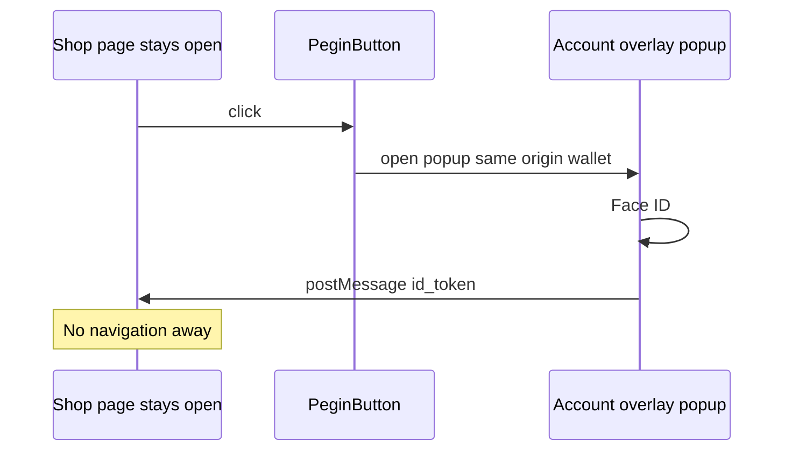

# User-facing UX — one button, no redirect, instant

> **North star:** **One button to rule them all** — the best sign-in control on the page. **No full-page redirects.** Valid session = **instant** (zero UI). Otherwise **one tap** → Face ID → in. No wallet/blockchain/PEGIN noise.

**Engineering names** (`pegin-wallet`, `pegin-mini`) stay in code only.

**Related:** [identity-username-and-account-flow.md](../10-architecture/identity-username-and-account-flow.md) · [mvp-strategy.md](../03-use-cases/mvp-strategy.md)

---

## One button to rule them all

There is **exactly one** primary auth control per page (when not already logged in).

| Principle | Meaning |
|-----------|---------|
| **One button** | Not “PEGIN + email + guest” — one beautiful **Continue** / **Sign in** |
| **Best UI** | Default `<PeginButton />` is **reference-quality** (motion, focus, a11y, dark mode) |
| **No redirect** | **Never** navigate the tab away to `auth.*` — popup or embedded sheet only |
| **Instant** | Valid JWT → **no button**; user is already inside the app |
| **Invisible infra** | No wallet, chain, DID, or PEGIN copy on the happy path |

```
Logged in     →  (no button — app content only)
Need auth     →  [ ONE BUTTON ]  →  passkey sheet  →  JWT  →  (button gone)
First time    →  same button  →  username + Face ID in overlay  →  done
```

---

## No redirect (non-negotiable)

**Banned for user-facing login:** full-page `window.location` to an IdP, blank redirect flash, “returning to merchant…”

**Required pattern:**

| Technique | User perception |
|-----------|-----------------|
| **Popup** to wallet origin (`postMessage` + JWT) | Stay on shop tab; small overlay |
| **Modal sheet** (iframe / WebView to wallet UI) | Same page, slide-up panel |
| **Browser extension** (later) | Button → instant sign, no popup |
| **Silent `restore()`** on load | Instant — no button |

OAuth **authorization code + redirect** may exist for legacy servers; **SDK default for websites is popup/modal**, not redirect. Redirect is **integrator opt-in**, not the product demo.



---

## Instant login (three speeds)

| Speed | When | Clicks | PEGIN visible |
|-------|------|--------|---------------|
| **0 — Instant** | Valid JWT / refresh on page load | **0** | **No** |
| **1 — One tap** | Account exists, session expired | **1** (button → Face ID) | Button only, then gone |
| **2 — Setup once** | No account | **1** + username in overlay | Minimal “Create account” |

**Target:** 90% of return visits are **speed 0**.

### SDK bootstrap (before paint)

```typescript
const session = await PeginSession.restore({ clientId })
if (session.valid) {
  renderApp(session.user) // NO auth UI, NO PeginButton
  return
}
renderAppWithSignIn(<PeginButton onSuccess={...} />)
```

---

## The button — best UI you can ship

`<PeginButton />` is a **product surface**, not a gray OAuth stub.

### Design bar

| Requirement | Detail |
|-------------|--------|
| **Visual** | Large tap target (min 44px), clear label, subtle depth, respects `prefers-color-scheme` |
| **Brand** | Site may pass `theme` — button **blends** with merchant design (not ugly third-party badge) |
| **States** | idle → loading (inline, no redirect spinner page) → success (collapse to avatar) |
| **Logged in** | Morphs to **@username** chip or **hides** entirely |
| **a11y** | Focus ring, `aria-busy`, keyboard activate |
| **Copy default** | **Continue** or **Sign in** — not “Login with PEGIN” on every merchant page |
| **Motion** | Short ease on success; no full-screen flash |

### Anti-patterns (reject in design review)

- Small washed-out “Sign in with …” rectangle from 2010 OAuth
- Full-page redirect + white screen
- Multiple competing sign-in buttons
- Showing PEGIN logo after user is already authenticated
- “Connect wallet” wording

### Reference components (MVP)

| Component | Role |
|-----------|------|
| `<PeginButton />` | The one button |
| `<PeginSession />` | Headless restore + silent refresh |
| `<PeginUserChip />` | `@alice` when logged in (optional replace button) |

---

## User-facing copy (login path)

| Never show | Use |
|------------|-----|
| Wallet / blockchain / DID / Chia / vault | *(omit)* |
| Login with PEGIN (every visit) | **Continue** / **Sign in** / hide when session valid |
| Redirect messages | Inline loading on button only |

**Account app (once):** “Create your account” + username + Face ID — not “Create wallet”.

---

## Account before login (unchanged, invisible)

- DID + username created in **account app / overlay** — not on shop DB form.
- First click on the **one button** may open setup overlay — still **no redirect**.
- Vault/seed = Settings only (Step 2).

Detail: [identity-username-and-account-flow.md](../10-architecture/identity-username-and-account-flow.md).

---

## MVP acceptance tests

| # | Pass when |
|---|-----------|
| 1 | Valid session: **no** auth button, **no** PEGIN text, **no** redirect |
| 2 | Expired session: **one** button click → Face ID → in **&lt; 1s** after biometric |
| 3 | Entire flow: shop URL **never** changes to IdP domain |
| 4 | Button meets min size / contrast / dark mode |
| 5 | First account: overlay only, no seed at signup |

---

## Engineering map (hidden)

| User sees | Implementation |
|-----------|----------------|
| One button | `@pegin/sdk` `PeginButton` |
| No redirect | `window.open` wallet popup + `postMessage` or modal iframe |
| Instant | `localStorage` / secure refresh + `PeginSession.restore()` |
| Face ID | WebAuthn in popup |
| JWT | Wallet signs; site validates |

---

## Related

| Doc | Topic |
|-----|--------|
| [login-with-pegin-vs-social-idp.md](login-with-pegin-vs-social-idp.md) | vs Apple |
| [mini-wallet-and-recovery-vault.md](../10-architecture/mini-wallet-and-recovery-vault.md) | Technical layer |

*UX principles v0.2 · One button, no redirect · May 2026*
