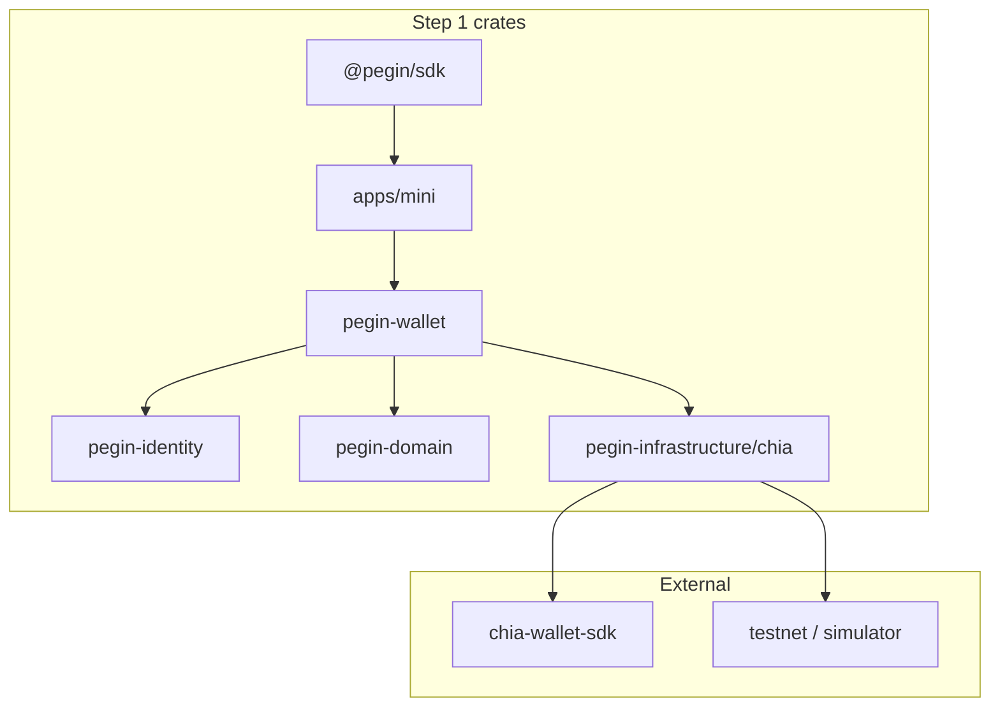

# Step 1 — implementation bootstrap (start coding)

> **Goal:** Ship **wallet-as-IdP** — mini app + DID + passkey + **JWT minted in wallet** + `@pegin/sdk` + one demo site. **No** DIG-first, **no** vault (Step 2), **no** central `pegin-auth` cloud requirement.

**Product:** [mvp-strategy.md](../../03-use-cases/mvp-strategy.md) · **UX:** [user-facing-ux-principles.md](../../02-product/user-facing-ux-principles.md) · **Architecture:** [application-architecture.md](../../10-architecture/application-architecture.md)

---

## What Step 1 is (definition of done)

| # | Deliverable | Done when |
|---|-------------|-----------|
| 1 | **Account in app** | Username + passkey + DID on testnet (faucet); local encrypted profile |
| 2 | **Wallet signs JWT** | `sub`, `preferred_username`, `aud`, `exp`; JWKS from DID doc |
| 3 | **`pegin-mini`** | Tauri v2 shell — create account + show @username |
| 4 | **`@pegin/sdk`** | `<PeginButton />`, `PeginSession.restore()`, popup (no full-page redirect) |
| 5 | **Demo app** | One SPA validates JWT → `users` row by `sub` |
| 6 | **Cross-device** | Desktop QR → phone passkey → JWT (app channel MVP) |
| 7 | **Tests** | `chia-sdk-test` for DID; JWT round-trip unit tests |

**Explicitly not Step 1:** vault, seed UI, DIG stores, SAML, SCIM, `pegin-protocols` server, Notbot, on-site tx signing.

---

## Repo strategy (recommendation)

### One monorepo: `pegin` (this repository)

Keep **docs + code** in one place while Step 1–2 are small team / solo.

| Pros | Cons |
|------|------|
| Single PR spans spec + code | Repo grows large later |
| `docs/` already canonical | CI matrix heavier eventually |
| Matches [application-architecture.md](../../10-architecture/application-architecture.md) workspace | |

**Layout after bootstrap:**

```
pegin/                          # git root (docs + code)
├── docs/                       # existing — do not move
├── crates/                     # Rust workspace members (Step 1 subset)
├── apps/
│   ├── mini/                   # Tauri (pegin-mini UI)
│   └── demo-web/               # Vite/React test relying party
├── packages/
│   └── sdk/                    # @pegin/sdk (npm)
├── contracts/                  # empty until Step 2 (Rue)
├── deploy/dev/                 # later: compose
├── scripts/                    # faucet dev, ci helpers
├── Cargo.toml                  # workspace root
├── package.json                # pnpm workspace (optional)
├── CLAUDE.md
└── knowledge.base
```

### When to split repos (later)

| Repo | Split when |
|------|------------|
| `pegin-sdk` (npm only) | External adopters need independent semver releases |
| `pegin-contracts` | Rue pipeline + audits on own cadence |
| `pegin-docs` | Only if legal/marketing wants public docs separate from private code |

**Do not split before Step 1 ships** — integration cost is higher than monorepo noise.

### External dependencies (not your repos)

| Upstream | Use |
|----------|-----|
| [xch-dev/chia-wallet-sdk](https://github.com/xch-dev/chia-wallet-sdk) | DID, `SpendContext`, simulator |
| [xch-dev/rue](https://github.com/xch-dev/rue) | Step 2 vault only |
| [xch-dev/sage](https://github.com/xch-dev/sage) | Reference for Tauri layout |
| [1Password/passkey](https://github.com/1Password/passkey) crate | WebAuthn in Rust |

Fork only if you must patch SDK; prefer **pin versions** from [tech-stack.md](../../04-technical/specs/tech-stack.md).

---

## Step 1 workspace (slim — not full Phase 3 layout)

Full target workspace has `pegin-authorization`, `pegin-federation`, etc. **Step 1 creates only:**

```
crates/
├── pegin-domain/           # Did, Username, Sub, SessionId, AppError
├── pegin-identity/         # ports: IdentityRepository, PasskeyRp
├── pegin-wallet/           # DID create, JWT sign/verify, profile store
├── pegin-infrastructure/   # chia adapter (feature chia); local profile JSON/SQLite
└── pegin-testing/          # fixtures, chia-sdk-test helpers

apps/mini/                  # Tauri → calls pegin-wallet
packages/sdk/               # TS → popup, postMessage, restore()
apps/demo-web/              # example RP
```

**Add in Step 2:** `contracts/`, vault module in `pegin-wallet`, recovery UI in `apps/mini`.

**Add post-MVP:** `pegin-protocols`, `pegin-api` (if hosted OIDC needed), `pegin-authorization` (PePP), DIG adapters.



---

## How to begin (week 0 — bootstrap)

### Prerequisites

| Tool | Version |
|------|---------|
| Rust | stable via [rustup](https://rustup.rs/) |
| Node | 20 or 22 LTS |
| pnpm or npm | for SDK + demo |
| Tauri deps | [Tauri prerequisites](https://v2.tauri.app/start/prerequisites/) for `apps/mini` |

### Day 1 — skeleton (commands are illustrative)

```bash
cd pegin   # repo root

# 1. Rust workspace
mkdir -p crates apps/mini apps/demo-web packages/sdk contracts scripts

# 2. Root Cargo.toml — workspace with members:
#    crates/pegin-domain, pegin-identity, pegin-wallet,
#    pegin-infrastructure, pegin-testing

# 3. First crate: pegin-domain (no chia dep)
cargo new --lib crates/pegin-domain

# 4. Pin chia-wallet-sdk in pegin-infrastructure/Cargo.toml (see tech-stack)

# 5. Proof: chia-sdk-test creates a DID in simulator
cargo test -p pegin-infrastructure

# 6. packages/sdk — Vite + TS, export PeginButton stub
# 7. apps/demo-web — depends on @pegin/sdk
```

Commit message style: `chore: bootstrap Step 1 workspace skeleton`.

### Week 1–2 — vertical slice order

Build in this order (each step demoable):

| Order | Build | Why first |
|-------|--------|-----------|
| 1 | `pegin-domain` types + errors | Everything depends on it |
| 2 | `pegin-infrastructure` + `chia-sdk-test` DID create | Proves Chia path |
| 3 | `pegin-wallet` local profile (username, did, passkey ids) | No UI yet |
| 4 | WebAuthn register/assert in `pegin-wallet` | passkey crate |
| 5 | JWT sign + verify (ES256 key in profile) | Apps need token |
| 6 | `apps/mini` Tauri — create account screen | Account-first UX |
| 7 | `packages/sdk` `PeginSession.restore` + stub button | Silent login |
| 8 | Popup + `postMessage` JWT to demo web | No redirect |
| 9 | Testnet faucet module | DID create fees |
| 10 | QR cross-device session (phone ↔ desktop) | [cross-device-login-and-vault-recovery.md](../../10-architecture/cross-device-login-and-vault-recovery.md) |

### Week 3 — polish Step 1

- JWKS publication (static endpoint in mini app or embed in DID doc resolver)
- Demo app `users` table + middleware
- UX pass: [user-facing-ux-principles.md](../../02-product/user-facing-ux-principles.md)
- CI: `cargo test`, `cargo clippy`, `pnpm test`

---

## Crate responsibilities (Step 1)

| Crate | Owns | Must not own |
|-------|------|----------------|
| **pegin-domain** | `Username`, `Did`, `Sub`, `JwtClaims`, errors | axum, chia, sqlx |
| **pegin-identity** | Traits: `IdentityStore`, `PasskeyAuthenticator` | concrete Chia |
| **pegin-wallet** | Use cases: `CreateAccount`, `SignJwt`, `AssertPasskey`; orchestration | HTTP routes |
| **pegin-infrastructure** | `ChiaDidGateway`, `LocalProfileStore` (JSON/SQLite) | business rules |
| **pegin-testing** | Simulator helpers, test JWT keys | production code |
| **apps/mini** | UI only | domain logic |
| **packages/sdk** | Browser API | Rust |

---

## Data stored where (Step 1)

| Data | Step 1 store |
|------|----------------|
| Username, passkey credential ids, JWT signing pubkey | **Local encrypted file** in mini app (migrate to DIG later) |
| DID | **Chia testnet** (+ simulator in CI) |
| Site session | Demo app cookie + SDK `localStorage` refresh handle |
| Vault, seed | **Step 2** |

---

## `pegin-auth` / `pegin-api` in Step 1?

**Default: no standalone auth server.** Wallet is the IdP:

- `apps/mini` exposes `pegin://` or `https://localhost:PORT` for popup origin
- JWT minted inside `pegin-wallet` invoked from Tauri

Optional later: small Axum crate for JWKS hosting or legacy OIDC redirect — **not** Step 1 blocker.

---

## CI (minimal)

```yaml
# .github/workflows/ci.yml (when ready)
# - cargo fmt --check
# - cargo clippy --workspace
# - cargo test --workspace
# - pnpm -r test (sdk + demo)
```

No testnet in CI gate — simulator only. Weekly optional `testnet11` job `#[ignore]` locally.

---

## First PR checklist

- [ ] Workspace builds `cargo build --workspace`
- [ ] Simulator test: create DID
- [ ] Unit test: JWT sign/verify round-trip
- [ ] Mini app: create @username + passkey
- [ ] SDK: restore returns null when empty; valid after login
- [ ] Demo app: protected route needs JWT
- [ ] README “Step 1” points here
- [ ] No user-facing word “wallet” in mini app copy

---

## After Step 1 → Step 2

| Add | See |
|-----|-----|
| `contracts/` Rue vault | [recovery-vault-and-guardians.md](../../10-architecture/recovery-vault-and-guardians.md) |
| Seed backup UI | Security settings only |
| Vault spends in simulator | Rigidity `VaultInfo` upstream |

---

## Related

| Doc | Topic |
|-----|--------|
| [developer-environment.md](../environment/developer-environment.md) | OS, rustup, tools |
| [test-architecture.md](test-architecture.md) | Test pyramid |
| [tech-stack.md](../../04-technical/specs/tech-stack.md) | Dependency pins |

*Step 1 bootstrap v0.1 · May 2026*
