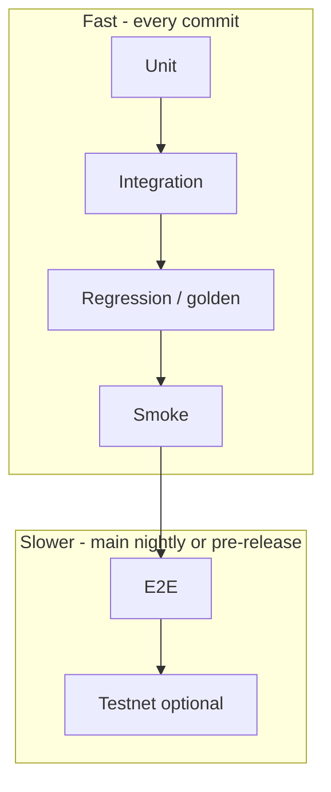

# Test architecture

> **Hub:** [../README.md](../README.md) · **Style:** [linting-and-formatting.md](linting-and-formatting.md) · **Structure:** [../architecture/application-architecture.md](../architecture/application-architecture.md)

PEGIN needs a **test system from the first commit**: fast feedback locally, test wallets and flows for Chia/DIG, and room to grow unit → integration → regression → smoke → e2e without rewriting everything later.

**TDD (write test first) is not mandatory.** **Tests are mandatory** at the right layers, and the **prototype harness** (simulator wallets, fake DIG, virtual passkeys) ships with the POC.

---

## Goals

| Goal | How |
|------|-----|
| **Fast default** | Most runs &lt; 2 minutes on laptop; unit + integration in CI on every PR |
| **Realistic Chia** | `chia-sdk-test` simulator for speed; testnet for periodic confidence |
| **Repeatable identity flows** | Scripted test wallets, funded keys, known DIDs |
| **Scale in CI** | Parallel crates; sharded e2e nightly; cache simulator DB |
| **Regression safety** | Golden fixtures for JWT claims, DIG JSON, CLVM puzzle hashes |

---

## Test pyramid



| Level | Scope | Target runtime | Tools (planned) |
|-------|--------|----------------|-----------------|
| **Unit** | Domain rules, mappers, JWT claims, grant expiry | Seconds | `cargo test -p pegin-domain`, `#[test]` |
| **Integration** | Repos + gateways with simulator / fakes | &lt; 60s per crate | `chia-sdk-test`, in-memory DIG, `wiremock` for SMTP |
| **Regression** | Snapshot / golden files must not change silently | Seconds–minutes | `insta`, committed fixtures under `tests/fixtures/` |
| **Smoke** | Binary starts, health routes, config loads | &lt; 30s | `cargo test -p pegin-api -- smoke_*` or `reqwest` against `pegin-api` in CI |
| **E2E** | Register → login → JWT → optional OIDC callback | Minutes | Playwright + virtual WebAuthn; or scripted HTTP + test authenticator |
| **Testnet** | Real node + faucet (optional weekly) | Minutes–hours | Chia testnet11; marked `#[ignore]` locally |

**Rule:** push detail **down** the pyramid. One e2e path per critical journey; everything else integration or unit.

---

## Test wallets and Chia flows (prototype first)

Build this **before** feature velocity — it unblocks all other tests.

### 1. Simulator wallet (default, fast)

Use **[chia-sdk-test](https://github.com/xch-dev/chia-sdk-test)** (see [tech-stack.md](../../04-technical/specs/tech-stack.md)):

| Asset | Purpose |
|-------|---------|
| `Simulator` instance | In-process chain; no testnet latency |
| Prefunded `StandardWallet` / puzzle hashes | Pay DID registration, anchor spends |
| Deterministic seed (e.g. from `PEGIN_TEST_SEED` env) | Reproducible addresses across runs |

**Prototype deliverable:** `pegin-testing` crate (or `pegin-infrastructure/tests/support`):

```text
pegin-testing/
├── src/
│   ├── simulator.rs      # start simulator, fund wallet
│   ├── test_wallet.rs    # create/sign spends
│   └── did_factory.rs    # register DID for tests
└── tests/
    └── wallet_smoke.rs    # proves harness works
```

### 2. Test personas

| Persona | Simulator use | Passkey / auth |
|---------|---------------|----------------|
| `alice` | DID + coins | Virtual authenticator credential id (fixed) |
| `bob` | Manager approver (PePP) | Second credential |
| `enterprise_admin` | Merkle root publisher | N/A |

Store **non-secret** metadata in repo (`tests/fixtures/personas.json`). **Never** commit mainnet keys; testnet keys only in CI secrets if needed.

### 3. DIG test double

| Mode | When |
|------|------|
| **In-memory store** | Default integration tests; `HashMap` keyed by store id |
| **Temp DIG peer** (containers) | Optional nightly when compose stack exists; see [developer-environment.md](../environment/developer-environment.md) |
| **Recorded fixtures** | Regression: load `grant_approved.json` → assert mapper output |

Trait: same `GrantRepository` / `AuditRepository` ports as production ([application-architecture.md](../architecture/application-architecture.md)).

### 4. WebAuthn in tests

| Approach | Level |
|----------|--------|
| Mock `PasskeyVerifier` trait returning fixed assertion | Unit / integration |
| `@simplewebauthn/server` test vectors | Integration |
| Playwright **virtual authenticator** | E2E |

POC: prove **one** register + login path in integration with mock verifier; add Playwright e2e when `pegin-api` is stable.

---

## F.I.R.S.T. tests (Clean Code, adapted)

Robert C. Martin’s **F.I.R.S.T.** properties — we aim for them without requiring test-first authoring:

| Property | Meaning for PEGIN |
|----------|-------------------|
| **Fast** | Simulator, not testnet, in default `cargo test` |
| **Independent** | No order dependency; each test creates own wallet/DIG store |
| **Repeatable** | Deterministic seed; no wall-clock flake in unit/integration |
| **Self-validating** | Assert pass/fail; no manual log inspection in CI |
| **Timely** | Add tests when adding behavior; harness exists before large features |

---

## Layout (planned)

```text
pegin/
├── pegin-domain/
│   └── src/...           # unit tests in same file (#[cfg(test)])
├── pegin-identity/
│   └── tests/            # integration tests
├── pegin-infrastructure/
│   └── tests/            # chia + DIG integration
├── pegin-api/
│   └── tests/smoke.rs
├── pegin-testing/        # shared harness (dev-dependency)
├── tests/
│   ├── fixtures/         # golden JSON, JWT snapshots
│   └── e2e/              # Playwright (TypeScript) or rust e2e
└── pegin-contracts/
    └── tests/            # rue / chia-sdk-test CLVM
```

**Workspace:**

```toml
[workspace.metadata.ci]
# Documented intent — wire in .github/workflows when repo has code
fast = "cargo test --workspace --exclude pegin-e2e"
slow = "cargo test --workspace -- --ignored"
```

---

## CI tiers (scale)

| Tier | Trigger | Commands |
|------|---------|----------|
| **PR fast** | Every push | `fmt`, `clippy`, `cargo test` (unit + integration, no `ignored`) |
| **PR smoke** | Every push | Start `pegin-api` in background; hit `/health`, `/.well-known/openid-configuration` |
| **Main nightly** | Cron | `cargo test -- --ignored` (testnet if configured); e2e Playwright |
| **Release** | Tag | Full matrix + Rue contract tests + fixture diff review |

Parallelize by crate: `cargo test -p pegin-identity` jobs in matrix.

---

## Regression fixtures

| Fixture type | Example path | Guards |
|--------------|--------------|--------|
| DIG grant record | `tests/fixtures/dig/grant_approved.json` | PePP schema version |
| JWT claims | `tests/fixtures/jwt/session_claims.json` | OIDC consumer apps |
| Merkle root / anchor | `tests/fixtures/chia/bulk_root.hex` | Enterprise bulk provision |
| SAML metadata snapshot | `tests/fixtures/saml/idp_metadata.xml` | Enterprise bridge |

Breaking changes: update fixtures **in the same PR** with a short “contract change” note in the description.

---

## POC test checklist (definition of done)

Wire these before calling the POC “done” ([mvp-strategy.md](../../03-use-cases/mvp-strategy.md)):

- [ ] `pegin-testing`: simulator starts, funds wallet, creates DID  
- [ ] Unit: passkey challenge validation (mock)  
- [ ] Integration: register → DID on simulator → profile on in-memory DIG  
- [ ] Integration: login → JWT validates with test issuer keys  
- [ ] Regression: JWT claims match golden fixture  
- [ ] Smoke: `pegin-api` health + OIDC discovery  
- [ ] E2E (minimal): one scripted login path (mock or virtual authenticator)  
- [ ] CI: PR tier runs in &lt; 10 minutes (target; tune as crates grow)

---

## What we avoid

| Anti-pattern | Why |
|--------------|-----|
| Only manual testnet testing | Slow, flaky, blocks CI |
| E2E for every edge case | Expensive; use unit/integration |
| Shared mutable global wallet | Flaky parallel tests |
| `unwrap` in tests without message | Obscures failures |
| Skipping tests on main | Default branch stays green with real gates |

---

## Related

- [linting-and-formatting.md](linting-and-formatting.md)  
- [application-architecture.md](../architecture/application-architecture.md)  
- [tech-stack.md](../../04-technical/specs/tech-stack.md) · [on-chain-architecture.md](../architecture/on-chain-architecture.md)  
- [mvp-strategy.md](../../03-use-cases/mvp-strategy.md)

*Test architecture v1.0 · May 2026*
