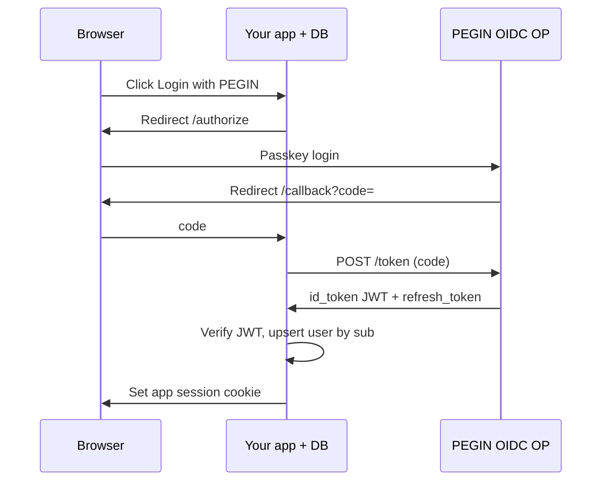

# Existing apps, user databases, and standard SSO protocols

> **Audience:** Developers integrating PEGIN into a site that already has users, passwords, or another IdP.  
> **Related:** [sdk-guide.md](sdk-guide.md) · [enterprise-identity-spec.md](../../04-technical/specs/enterprise-identity-spec.md) · [mini-wallet-and-recovery-vault.md](../../10-architecture/mini-wallet-and-recovery-vault.md)

---

## Mental model: PEGIN is the IdP (like Okta or Entra)

Your website stays the **relying party** (OIDC) or **service provider** (SAML). Your **user database stays yours**. PEGIN only answers: “who just authenticated?” with **standard tokens** — same as “Sign in with Google.”

```
┌─────────────────────┐         ┌─────────────────────┐         ┌─────────────────────┐
│  Your app + your DB │ ◀─JWT── │  PEGIN (IdP)        │ ◀────── │  User (passkey)     │
│  users, orders, …   │  SAML   │  WebAuthn + DID     │         │  Face ID            │
└─────────────────────┘         └─────────────────────┘         └─────────────────────┘
```

**Chia/DID never replaces your `users` table.** You add a stable foreign key (`pegin_sub` or `did`) and keep email, billing, roles in your schema.

---

## JWT and session lifetime (what you asked for)

Login with PEGIN should feel **exactly like SSO**: user signs in once at the IdP, your app gets a **time-limited token**, then uses it until **exp** (and optionally **refresh**).

### POC: OIDC tokens (preferred for new web apps)

| Token | Typical TTL | Purpose |
|-------|-------------|---------|
| **id_token** (JWT) | 15–60 min | Who the user is (`sub`, `iss`, `aud`, `exp`, `iat`) |
| **access_token** (JWT or opaque) | 15–60 min | Call PEGIN userinfo / APIs |
| **refresh_token** | days–weeks | Get new id/access without passkey (policy-dependent) |

**Your app validates:**

1. Signature via PEGIN **`jwks_uri`** (OIDC discovery)
2. `exp` not passed, `aud` = your `client_id`, `iss` = PEGIN issuer URL
3. Map **`sub`** → row in **your** `users` table

Example claims (illustrative):

```json
{
  "iss": "did:chia:…",
  "sub": "pegin:usr:8f3a…",
  "aud": "my-saas-client-id",
  "exp": 1716307200,
  "iat": 1716303600,
  "preferred_username": "alice",
  "pegin_did": "did:chia:…"
}
```

- **`sub`** — stable join key for your `users` table (immutable).
- **`preferred_username`** — human handle like email (`alice`); UI: `@alice`.
- **`pegin_did`** — cryptographic root for audit.

Wallet **account** (username + DID) must exist before site login. See [identity-username-and-account-flow.md](../../10-architecture/identity-username-and-account-flow.md).

### Optional: your app’s own session JWT

Many teams do **both**:

1. Exchange OIDC code → validate PEGIN **id_token**
2. Create **app session** (`jwt.sign({ user_id: 42 }, APP_SECRET, { expiresIn: '7d' })`) or HTTP-only cookie

That is normal. PEGIN tokens prove identity at login; **your** session drives `GET /api/orders`.

### Phase 1: SAML 2.0 (XML assertions)

Enterprise apps (SharePoint-era SPs, some HR tools) expect **SAML**, not JWT on the wire:

| OIDC | SAML 2.0 |
|------|----------|
| JWT `id_token` | XML **Assertion** (signed) |
| `sub` claim | **NameID** |
| Custom claims | **AttributeStatement** (email, groups) |
| HTTP redirect + code | HTTP-POST/Redirect binding |

Same lifecycle: assertion has **NotOnOrAfter** (expiry). Your SP middleware validates XML signature, maps NameID → `users.id`, creates local session.

PEGIN role: **SAML IdP** — see [enterprise-identity-spec.md](../../04-technical/specs/enterprise-identity-spec.md).

### Other common web auth (how PEGIN fits)

| Method | PEGIN role |
|--------|------------|
| **OAuth 2.0** | PEGIN is **authorization server**; apps use code + token for scopes |
| **OpenID Connect** | Primary modern SSO on top of OAuth (**POC**) |
| **SAML 2.0 (XML)** | Enterprise SSO (**Phase 1**) |
| **LDAP** | Legacy read/bind gateway (**Phase 3**) — apps that still LDAP-bind |
| **WS-Federation** | Legacy Microsoft SPs (**Phase 3+**) |
| **Password / local DB** | **Your app** during migration; optional dual login until cutover |

PEGIN does **not** replace every protocol inside your monolith on day one. It **fronts** authentication; your app keeps authorization (roles, ABAC) in your DB.

---

## Existing user database — three patterns

### A. Just-in-time (JIT) — new SSO users

User logs in with PEGIN; app has never seen them.

```
OIDC callback → sub / did → SELECT * FROM users WHERE pegin_sub = ?
  → if missing: INSERT (pegin_sub, did, created_at)
  → issue app session
```

No migration batch required. Good for greenfield apps or “PEGIN optional.”

### B. Account linking — existing email/password users

User already has `users.id = 42` with email login.

1. User logs in **locally** (or via email magic link once).
2. User clicks **“Link Sign in with PEGIN”** → PEGIN register/login.
3. Your backend: `UPDATE users SET pegin_sub = ?, did = ? WHERE id = 42`.
4. Next time: PEGIN-only login resolves to same row.

Dual login during transition: `WHERE email = ? OR pegin_sub = ?`.

### C. Enterprise hub — Entra + PEGIN

Large orgs keep **Microsoft Entra** for M365; non-Microsoft apps use PEGIN as **external SAML/OIDC IdP**, or Entra **federates** to PEGIN. Your SaaS still stores `users`; Entra/PEGIN only feed `sub` + groups.

See [enterprise-identity-spec.md § Migration patterns](../../04-technical/specs/enterprise-identity-spec.md#migration-patterns-official-microsoft-guidance).

---

## End-to-end: modern website (OIDC)



**Instant login** happens at PEGIN (passkey + DIG). Your server only does HTTP token exchange + DB lookup — milliseconds.

---

## What to store in your database

| Column | Purpose |
|--------|---------|
| `id` | Your primary key (unchanged) |
| `pegin_sub` | OIDC `sub` (stable) |
| `did` | Optional `did:chia:…` for audit/portability |
| `email`, `name`, … | Your app data (unchanged) |
| `password_hash` | Nullable after migration |

Do **not** store passkey private keys or DID secret keys in your app DB.

---

## Protocol rollout vs your stack

| Your app today | Add PEGIN via |
|----------------|---------------|
| Custom JWT auth | OIDC RP + map `sub` → `users` |
| Auth0 / Firebase | Replace or federate IdP to PEGIN OIDC |
| SAML SP already | Register PEGIN as SAML IdP (metadata XML) |
| Session cookies only | OIDC callback → create same cookie after verify |
| API-only backend | Bearer **access_token** from PEGIN + local API keys |

Full protocol order: [roadmap.md](../../03-use-cases/roadmap.md) · Spec 2: [enterprise-identity-spec.md](../../04-technical/specs/enterprise-identity-spec.md).

---

## Security checklist for app developers

1. Always validate **PEGIN JWT** (JWKS, `exp`, `aud`, `iss`) — never trust `sub` from query params alone.
2. Use **`sub`** as join key; treat `pegin_did` as supplementary.
3. Keep **authorization** (admin, paid plan) in your DB, not only in token claims.
4. On logout: clear app session **and** call PEGIN end-session / revoke refresh if implemented.
5. Short **id_token** TTL + refresh rotation matches enterprise SSO hygiene.

---

## POC minimum for “works like SSO”

| Endpoint | Spec |
|----------|------|
| `/.well-known/openid-configuration` | OIDC Discovery |
| `/authorize` | OAuth2 code flow |
| `/token` | Returns `id_token`, `access_token`, `refresh_token` |
| `/jwks` | Verify JWT |
| Optional `/userinfo` | email, name |

Demo app + one SQL `users.pegin_sub` column proves existing-DB integration without SAML/XML in week 1.

*Integration guide v0.1 · May 2026*
