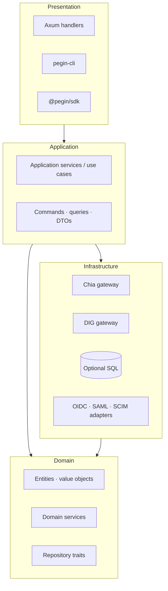
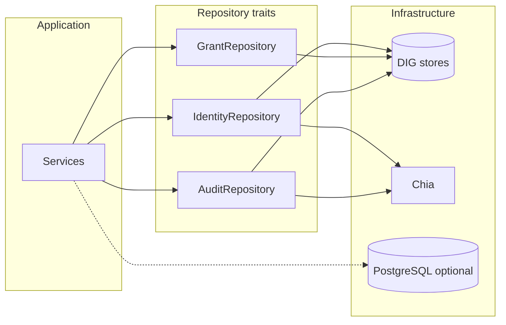

# Application architecture (PoEAA + DDD)

> **Reference:** [Martin Fowler — *Patterns of Enterprise Application Architecture*](https://martinfowler.com/books/eaa.html) (layering, domain model, data mapper, repository, service layer, unit of work).  
> **Hub:** [architecture-overview.md](architecture-overview.md) · **Developers:** [../08-developer/developer-documentation.md](../08-developer/developer-documentation.md) · **On-chain:** [on-chain-architecture.md](on-chain-architecture.md) · **DIG:** [dig-enterprise-transformation.md](dig-enterprise-transformation.md)

This document defines **how Rust services are structured** before the workspace is fully implemented. It maps classic enterprise patterns to PEGIN’s split persistence: **Chia** (anchors), **DIG** (application layer — primary data), optional **SQL** (operator-only). See [dig-as-application-layer.md](dig-as-application-layer.md).

---

## Table of contents

- [Goals](#goals)
- [Layering](#layering)
- [Bounded contexts (modules)](#bounded-contexts-modules)
- [Rust workspace layout](#rust-workspace-layout)
- [Domain model](#domain-model)
- [Application layer](#application-layer)
- [Infrastructure and persistence](#infrastructure-and-persistence)
- [PoEAA pattern choices](#poeaa-pattern-choices)
- [SQL and ORM policy](#sql-and-orm-policy)
- [Dependency rules](#dependency-rules)
- [POC vs later phases](#poc-vs-later-phases)

---

## Goals

| Goal | Implication |
|------|-------------|
| **Testable core** | Domain + application logic without HTTP, Chia node, or live DIG |
| **Clear boundaries** | Crates per bounded context; protocols stay behind interfaces |
| **Honest persistence** | No “one database” fiction — repositories hide Chia, DIG, and optional SQL |
| **Enterprise protocols** | OIDC/SAML/SCIM are adapters, not the domain model |
| **Replaceable infrastructure** | Swapping DIG peer, SQL vendor, or indexer does not rewrite identity rules |

---

## Layering

Fowler’s **four layers** (dependencies point **inward**):



| Layer | Responsibility | PEGIN examples |
|-------|----------------|----------------|
| **Presentation** | HTTP/CLI/SDK; request validation; map to commands | `POST /webauthn/register`, OIDC discovery routes |
| **Application** | Orchestrate use cases; transactions; no business rules hidden in handlers | `RegisterPasskey`, `IssueSessionJwt`, `ApproveGrant` |
| **Domain** | Invariants, identity rules, grant expiry | `Did`, `PasskeyCredential`, `PermissionGrant`, `AuditEvent` |
| **Infrastructure** | Chia, DIG, SQL, email SMTP, Entra SCIM client | `ChiaDidGateway`, `DigGrantRepository`, `SqlOidcClientMapper` |

**Not used as a default:** fat controllers, domain logic in Axum handlers, or **Active Record** on core identity types.

---

## Bounded contexts (modules)

Organize by **bounded context** (DDD), not by technical layer only. Each context owns its ubiquitous language and publishes integration events or calls application services across boundaries sparingly.

| Context | Responsibility | Primary store |
|---------|----------------|---------------|
| **identity** | DID lifecycle, passkey binding, recovery policy | Chia + DIG profile |
| **authentication** | WebAuthn ceremonies, session/JWT | DIG session store |
| **authorization** (PePP) | Grants, rules, approve/deny | DIG grant + audit stores |
| **audit** | Append-only events, export, anchor scheduling | DIG + Chia anchor |
| **federation** | SCIM, Entra sync, bulk merkle provision | DIG + Chia root |
| **protocols** | OIDC OP, SAML IdP, OAuth AS — **adapters** | SQL cache optional |
| **operator** | Tenant config, SLA metrics, rate limits | Optional SQL |

Contexts communicate via **application services** and **domain events** (e.g. `GrantApproved`, `UserTerminated`), not by sharing mutable entities across crates.

---

## Rust workspace layout

**Step 1 slim workspace** (what to create first): [step1-implementation-bootstrap.md](../08-developer/engineering/step1-implementation-bootstrap.md).

Full target workspace (align with [tech-stack.md](../../04-technical/specs/tech-stack.md)):

```
pegin/
├── Cargo.toml                    # workspace
├── crates/
│   ├── pegin-domain/             # shared kernel: IDs, errors, time
│   ├── pegin-identity/           # bounded context: DID, passkey
│   ├── pegin-wallet/             # Step 1: JWT + account use cases (IdP core)
│   ├── pegin-infrastructure/     # Chia, local profile; DIG/sql later
│   └── pegin-testing/
├── apps/mini/                    # Tauri — Step 1
├── contracts/                    # Rue — Step 2
├── pegin-auth/                   # optional hosted OIDC — post-MVP
├── pegin-authorization/          # PePP (Phase 2)
├── pegin-audit/                  # Phase 2
├── pegin-federation/             # Phase 1–3
├── pegin-api/                    # Axum — if needed
├── pegin-protocols/              # OIDC, SAML — post-MVP
├── pegin-cli/
└── packages/sdk/                 # @pegin/sdk
```

**Modularity rules**

- `pegin-domain` has **no** dependency on `pegin-infrastructure`, `axum`, or `chia-wallet-sdk`.
- `pegin-*` context crates depend on `pegin-domain` and define **repository traits** in `ports/` (or `domain::ports`).
- `pegin-infrastructure` implements those traits.
- `pegin-api` and `pegin-protocols` depend on application layer only, not on DIG/Chia types directly.

---

## Domain model

Use a **Domain Model** (rich objects), not an **Anemic Domain Model** where all logic sits in services. Fowler: behavior lives with data; application services coordinate.

### Core aggregates (POC + growth)

| Aggregate | Root | Invariants (examples) |
|-----------|------|------------------------|
| **UserIdentity** | `Did` | One active passkey set per device policy; DID immutable |
| **PasskeyRegistration** | ceremony id | Challenge freshness; RP ID match |
| **Session** | `SessionId` | Expiry; bound to `Did` |
| **PermissionGrant** (PePP) | `GrantId` | `expires_at`; `revoked`; signed approver DID |
| **AuditStream** | store id | Append-only; monotonic sequence |
| **EnterpriseDirectory** (later) | `TenantId` | Merkle root version; SCIM sync cursor |

### Value objects

`Did`, `PuzzleHash`, `GrantScope`, `AppId`, `PasskeyCredentialId`, `StoreAnchor`, `UtcPeriod` — validated at construction, no identity by reference.

### Domain services

Use when logic does not belong to one entity:

- `DidVerificationService` — verify anchor vs Chia head
- `GrantPolicyEvaluator` — PePP rules (Phase 2)
- `RecoveryEligibility` — timelock + multi-sig policy

### Anti-patterns to avoid

| Pattern | Why not for PEGIN core |
|---------|-------------------------|
| **Active Record** on `User` / `Grant` | Couples domain to SQL/DIG schema; hides Chia/DIG dual write |
| **Table Module** everywhere | Fine for **read-only reporting** SQL, not for identity writes |
| **Domain logic in OIDC crate** | Protocols are infrastructure |

---

## Application layer

**Application services** (Fowler *Service Layer*) implement one use case per type:

```rust
// Illustrative — not generated code
pub struct RegisterPasskey {
    identity_repo: Arc<dyn IdentityRepository>,
    chia: Arc<dyn ChiaAnchorGateway>,
    dig: Arc<dyn ProfileStore>,
    uow: Arc<dyn UnitOfWork>,
}

impl RegisterPasskey {
    pub async fn execute(&self, cmd: RegisterPasskeyCommand) -> Result<RegisterPasskeyResult, AppError> {
        // 1. domain: create / update UserIdentity
        // 2. infra: persist profile on DIG
        // 3. infra: anchor DID on Chia when required
        // 4. uow.commit()
    }
}
```

| Use case (POC) | Application service |
|----------------|---------------------|
| Register passkey | `RegisterPasskey` |
| Login (assertion) | `AuthenticatePasskey` |
| Issue JWT | `IssueSessionToken` |
| Append audit | `RecordAuditEvent` |

Handlers in `pegin-api` only: deserialize → call service → map `AppError` to HTTP.

---

## Infrastructure and persistence

Three **resource-oriented** backends; domain sees **repositories**, not SQL or RocksDB directly.



| Concern | Pattern | Implementation |
|---------|---------|----------------|
| Grants, audit bodies, sessions | **Repository** + **Data Mapper** | `DigGrantRepository` maps `PermissionGrant` ↔ DIG JSON ([permission-data-model](permission-data-model.md)) |
| DID anchor, merkle root | **Gateway** | `ChiaDidGateway`, `ChiaMerkleAnchorGateway` |
| OIDC client registry, SCIM staging | **Repository** + **Data Mapper** on SQL | Explicit `OidcClientRecord` ↔ row; **not** Active Record |
| Read models / admin search | **Table Data Gateway** or simple queries | Optional SQL views; no domain writes |

**Unit of Work:** scope a use case — e.g. append DIG audit + schedule Chia anchor in one `commit()`; if SQL is used, one DB transaction for operator tables only, then DIG (eventual consistency documented per use case).

**Identity Map:** per-request cache in Axum extensions or `UnitOfWork` instance to avoid duplicate loads within one HTTP request.

---

## PoEAA pattern choices

| Fowler pattern | PEGIN usage |
|----------------|-------------|
| **Domain Model** | **Yes** — `pegin-identity`, `pegin-authorization` |
| **Anemic Domain Model** | **Avoid** for core identity |
| **Data Mapper** | **Yes** — DIG JSON and SQL rows mapped explicitly |
| **Active Record** | **No** for identity/grants; optional only for trivial operator config if team accepts tradeoff |
| **Table Data Gateway** | **Optional** — reporting, admin lists |
| **Repository** | **Yes** — all domain persistence behind traits |
| **Gateway** | **Yes** — Chia, SMTP, Entra API |
| **Service Layer** | **Yes** — `pegin-application` / per-context services |
| **Unit of Work** | **Yes** — per use case |
| **Identity Map** | **Per request** |
| **Separated Interface** | **Yes** — `dyn Trait` repos for tests |
| **Registry** | **DI container** — `Arc<dyn …>` wired in `pegin-api` bootstrap |
| **Remote Facade** | HTTP API + SDK; not distributed domain objects |
| **DTO** | API request/response types separate from domain |

---

## SQL and ORM policy

| Question | Decision |
|----------|----------|
| Is SQL the system of record? | **No** for user identity, grants, or audit. **DIG + Chia** are. |
| When is SQL allowed? | Operator deployments: OIDC client cache, SCIM sync state, rate limits, dashboard aggregates |
| ORM (Diesel / SeaORM)? | **Discouraged** for domain aggregates. Prefer **sqlx** + hand-written **Data Mappers** per table |
| Migrations | `sqlx migrate` or `refinery` under `pegin-infrastructure/sql/migrations/` |
| Mapping style | One module per table group: `infrastructure::sql::oidc_client_mapper` |

Example mapper boundary (conceptual):

```
OidcClientRow (SQL)  ←→  OidcClientConfig (application DTO)
                         ≠ PermissionGrant (domain — lives on DIG only)
```

---

## Dependency rules

1. **Domain** imports nothing from infrastructure, axum, chia, or sqlx.
2. **Application** imports domain + port traits; not concrete DIG/Chia types.
3. **Infrastructure** implements ports; may import chia-wallet-sdk, dig-l2-storage, sqlx.
4. **Presentation** (`pegin-api`, `pegin-protocols`) imports application + DI wiring only.
5. **pegin-contracts** (Rue) is a **separate artifact** — Rust domain calls it via hashes/addresses, not CLVM in domain tests.

Cross-context: prefer **application events** or explicit facades over `pub use` re-exports between `pegin-auth` and `pegin-authorization`.

---

## POC vs later phases

| Phase | Structure focus |
|-------|-----------------|
| **POC** | `pegin-domain`, `pegin-identity`, `pegin-auth`, `pegin-infrastructure` (chia + dig), `pegin-api`; minimal SQL |
| **Phase 1** | `pegin-protocols`, `pegin-federation` (SCIM/merkle) |
| **Phase 2** | `pegin-authorization`, `pegin-audit` with anchor pipeline |
| **Phase 3+** | Operator SQL read models; dashboard crate |

---

## Related documents

| Doc | Topic |
|-----|--------|
| [on-chain-architecture.md](on-chain-architecture.md) | DIDs, Rue contracts |
| [dig-enterprise-transformation.md](dig-enterprise-transformation.md) | Enterprise data on DIG |
| [permission-data-model.md](permission-data-model.md) | PePP JSON on DIG |
| [tech-stack.md](../../04-technical/specs/tech-stack.md) | Crates, dependencies, checklist |
| [enterprise-identity-spec.md](../../04-technical/specs/enterprise-identity-spec.md) | Protocol standards |
| [linting-and-formatting.md](../08-developer/engineering/linting-and-formatting.md) | Style and review bar |
| [test-architecture.md](../08-developer/engineering/test-architecture.md) | Test pyramid, `pegin-testing`, CI |

*Application architecture v1.0 · May 2026 · Planning; code layout targets POC implementation.*
