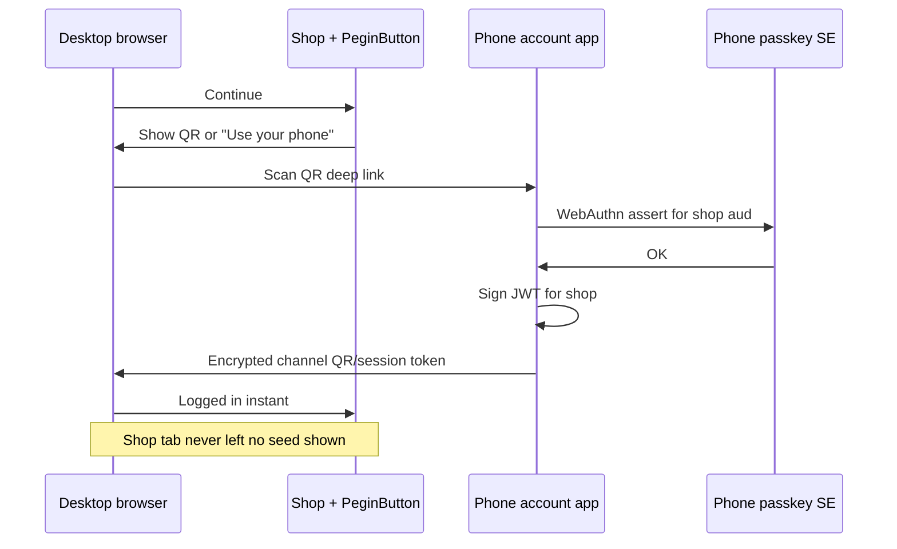
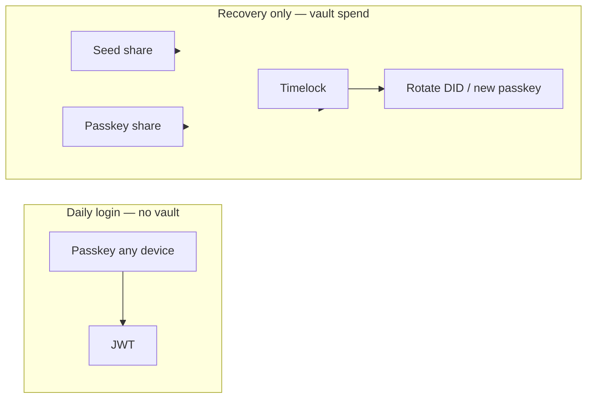

# Cross-device login, passkeys, seed phrase, and vault multisig

> **Problem:** New desktop — user must sign in **without seed phrase** on every visit. Phone scans QR (or synced passkey) → passkey auth → login. **Seed phrase** is for **vault recovery** (Step 2), not daily cross-device SSO. **Vault multisig** governs **recovery**, not normal login.

**Related:** [user-facing-ux-principles.md](../02-product/user-facing-ux-principles.md) · [recovery-vault-and-guardians.md](recovery-vault-and-guardians.md) · [mvp-strategy.md](../03-use-cases/mvp-strategy.md) · [identity-username-and-account-flow.md](identity-username-and-account-flow.md)

---

## Separate three problems (do not mix in UI)

| Problem | Tool | User sees |
|---------|------|-----------|
| **Daily login on new desktop** | **Passkey** (phone QR / sync / platform) | One button → scan or Face ID — **no seed** |
| **Lost all devices** | **Vault multisig** + **seed phrase** | Settings → Recovery — rare |
| **Add trusted device long-term** | Optional: register **second passkey** in account app | “Add this computer” after QR login |

**Mini wallet** holds DID + username. **Seed phrase** backs the **vault recovery share**, not the login button on Amazon.

---

## A — New desktop: login with phone (QR / passkey)

Same class of flow as **passkeys on a new laptop** with iPhone — FIDO2 **cross-device authentication** (hybrid / caBLE / QR).



### How it works (technical)

| Piece | Role |
|-------|------|
| **Desktop** | Shows QR encoding one-time session id + `client_id` + `aud` |
| **Phone app** (`pegin-mini`) | Already has account (username + DID + passkey registered on phone) |
| **QR scan** | Opens app → confirms site origin → runs **WebAuthn** on phone secure enclave |
| **JWT** | Phone **wallet IdP** signs JWT; delivers to desktop via short-lived token over QR follow-up poll or secure relay |
| **Desktop** | Stores session; `PeginSession.restore()` works next visit |

**Standards:** WebAuthn Level 2/3 **hybrid** transport; or app-specific secure channel (simpler MVP than full caBLE in browser).

**User copy:** “Scan with your phone to continue” — **not** “Import seed phrase.”

### Alternative: synced passkey (no QR)

If user uses **iCloud Keychain / Google Password Manager** synced passkeys:

- Desktop **Continue** → local Face ID / Windows Hello → same passkey credential id  
- No QR; still **no seed**

PEGIN should support **both** synced and phone-QR paths.

---

## B — What the mini wallet stores (by device)

| Device | Stores (encrypted local) |
|--------|---------------------------|
| **Phone (primary)** | Username, DID ref, **primary passkey**, JWT refresh keys, optional seed **encrypted backup** after Step 2 |
| **New desktop (after QR login)** | Session JWT + refresh for this browser; may **add second passkey** (“Trust this computer”) |
| **Neither** | Seed phrase on paper / password manager — **recovery only** |

**New desktop does not need the seed phrase** to log in if phone (or synced passkey) is available.

---

## C — Seed phrase: when it appears

| Moment | Seed phrase? |
|--------|----------------|
| First account create | **No** |
| QR login on new desktop | **No** |
| Step 2 — open Security → Backup | **Yes — show once**, user writes down |
| Recovery — lost phone + no sync | **Yes** — enter seed + vault path |

Seed phrase = **one share** in the **recovery vault** puzzle (m-of-n), not the login password.

---

## D — Vault multisig: what it looks like (Step 2)

Vault uses upstream **`VaultInfo` / Rue** ([Rigidity](https://github.com/Rigidity) / chia-wallet-sdk). **Login does not spend the vault.**

### Default policy (MVP Step 2 example)

**2-of-3 recovery custody** (illustrative):

| Share | Key material | Purpose |
|-------|--------------|---------|
| **1 — Seed phrase** | BIP-39 derived pubkey | Offline backup |
| **2 — Passkey A** | Phone secure enclave | “Something you have” |
| **3 — Passkey B** (optional) | Desktop, added after “Trust this device” | Second device |

**Daily login:** only **passkey assert** → JWT. **No vault spend.**

**Recovery (lost phone):** need **2 of 3** on-chain + **timelock** (e.g. 48h) before DID keys rotate.



### Recovery UX (user-facing — rare screen)

1. User chooses **“Recover account”** in account app (new phone, lost old phone).  
2. Enter **seed phrase** (share 1).  
3. If policy needs 2-of-3: also **passkey on old desktop** OR wait for timelock path per puzzle rules.  
4. **Timelock countdown** — “You can cancel if this wasn’t you.”  
5. After timelock → **register new passkey** on new phone → same **username** + DID lineage.  
6. Optional: re-add desktop via QR again.

**No blockchain words** — “Recover your account” / “Enter backup code” (seed styled as backup codes, not “mnemonic seed”).

### Multisig validation (what happens on chain)

| Step | Chain / app |
|------|-------------|
| User submits recovery intent | App builds **vault spend** with collected signatures |
| 1-of-n partial | Not enough — wait for more shares |
| m-of-n met | Spend allowed **after timelock** |
| Timelock active | Old passkey can **cancel** recovery |
| Timelock done | DID update / new inner key → app re-binds passkey |

Simulator tests: `chia-sdk-test` + upstream vault driver.

---

## E — New desktop + seed phrase (clarification)

| Question | Answer |
|----------|--------|
| Must I type seed on every new PC? | **No** — use phone QR passkey login |
| When do I need seed? | Lost **all** passkeys and devices; recovery flow only |
| Does mini wallet on phone require seed at install? | **No** at install; **yes once** in Backup (Step 2) |
| Does desktop mini wallet need seed file? | **No** for login; optional export forbidden in MVP |

---

## F — MVP phasing

| Phase | Ship |
|-------|------|
| **Step 1** | Phone account app; desktop **QR → phone passkey → JWT**; synced passkey if available |
| **Step 2** | Vault 2-of-3 (seed + passkey[s]); timelock; recovery screens |
| **Later** | Full caBLE in-browser; email guardian as 3rd share |

**Step 1 can demo QR login without vault on chain** — vault required before marketing “recover if you lose phone.”

---

## G — One button still holds

| Desktop state | Behavior |
|---------------|------------|
| Valid session | Instant — no button |
| No session, has phone | **One button** → QR / “Use phone” → passkey on phone → JWT |
| No session, no phone, has sync passkey | **One button** → local Face ID |
| Recovery | Separate **Recover account** link in app — not on shop checkout |

---

## SDK / desktop notes

```typescript
// Desktop: no passkey locally yet
<PeginButton mode="cross-device" /> // shows QR
// Phone app handles WebAuthn + JWT issue
// Desktop receives token → PeginSession.save()
```

Phone app registers as **WebAuthn authenticator** for cross-device ceremonies where browser supports it; else **app QR channel** is MVP.

---

## Related

| Doc | Topic |
|-----|--------|
| [recovery-vault-and-guardians.md](recovery-vault-and-guardians.md) | Email / Signer later |
| [user-facing-ux-principles.md](../02-product/user-facing-ux-principles.md) | One button, no redirect |

*Cross-device + vault v0.1 · May 2026*
