# Decentralized verification without a PEGIN-operated backend

> **Question:** Can validation live on Chia / DIG only — no `pegin-auth` service — and can a **Rue puzzle issue JWT**?

**Short answer:**

| Approach | Feasible? | Apple-like OIDC for random websites? |
|----------|-----------|--------------------------------------|
| Rue puzzle mints RFC 7519 JWT on chain | **No** (wrong layer) | No |
| DIG L2 alone replaces IdP | **Partial** — storage + attestations | Only if every app ships PEGIN verify SDK |
| Chia verifies BLS proof; app maps to session | **Yes** | Custom integration, not generic OIDC |
| **User device / any DIG peer** signs JWT bound to DID | **Yes** | Yes, if JWKS comes from DID doc |
| Community OIDC OPs (you don’t run one) | **Yes** | Yes — but *someone* runs HTTP |

---

## Why a Rue puzzle cannot “give a JWT”

| JWT / OIDC | Chia / Rue puzzle |
|------------|-------------------|
| HTTP redirects, `code`, `token_endpoint` | Coin spends, conditions, CLVM |
| Issuer signs JWS (RSA/ECDSA P-256) | BLS signatures on spends |
| Relying party uses **JWKS** over HTTPS | Full nodes / indexers read coin state |
| `exp`, `refresh`, OIDC discovery | Block height, timelocks, agg sig |

A puzzle can:

- Lock/unlock a DID in a vault (custody, m-of-n, timelock)
- Require signatures to match pubkeys in the inner puzzle
- Commit a **hash** of a DIG store update on chain

A puzzle **cannot**:

- Emit a standard `id_token` every Shopify instance validates with `openid-client`
- Perform WebAuthn (that is always off-chain in the device authenticator)

**Difficulty of “Rue puzzle → JWT”:** not “hard engineering” — **architecturally mismatched**. Expect weeks of custom app work per platform, not plug-in SSO.

---

## What DIG L2 is good for (and what it is not)

**DIG is strong at:**

- Encrypted profile: passkey credential id ↔ DID, recovery sessions
- Append-only login audit (which RP, when — user-oriented)
- Guardian email attestations, PePP grants later
- Merkle root anchored on Chia → tamper-evident history

**DIG is not, by itself:**

- An OIDC Authorization Server (no `/.well-known/openid-configuration` on chain)
- A JWT signer unless **some software** reads DIG and signs JWS (wallet, peer, browser)

So: you can avoid **PEGIN Inc. backend**, but you cannot avoid **software somewhere** that speaks HTTP to browsers and JWS to apps — unless apps abandon OIDC entirely.

---

## Three architectures (pick your tradeoff)

### 1. Pure chain + DIG verify (no JWT, no central OP)

```
User passkey → mini wallet signs BLS challenge
Website → reads DID pubkey from chain (or cache) → verifies signature
Optional → DIG merkle proof that passkey binding exists
```

| Pros | Cons |
|------|------|
| No PEGIN-operated IdP | Every site needs `@pegin/verify`, not Auth0-style OIDC |
| Verification truth on chain/DIG | Slower cold start (indexer); harder JWT libraries |

**Difficulty:** medium in Rust (`chia-wallet-sdk` + DIG client); **high** for “any WordPress plugin.”

---

### 2. **Wallet is the IdP** (PEGIN decentralized — **recommended “true north”**)

**PEGIN = the identity protocol (DID on Chia).**  
**The mini wallet = the IdP implementation** — it already knows who you are (passkey + DID). It can **mint the JWT inside the wallet** and hand it to the website. No PEGIN Inc. `pegin-auth` required.

```
Website                    Wallet (IdP)                    Truth
────────                   ────────────                    ─────
[Login with PEGIN]  ──▶  passkey ✓  DID ✓  (local)
       ◀── JWT ────      sign id_token { sub, aud, exp }
       validates JWKS tied to DID on Chia
```

#### How the website receives the JWT (web)

| Pattern | How wallet delivers JWT | Apple-like? |
|---------|-------------------------|-------------|
| **A. Popup / deep link** | `window.open` wallet origin → passkey → `postMessage` or redirect `?id_token=` to RP | Close (popup) |
| **B. Browser extension** | Extension signs JWT; page reads via `chrome.runtime` / injected API | Close |
| **C. Wallet-hosted OIDC** | Issuer URL = `https://wallet.<user-peer>` or fixed PEGIN wallet origin; classic redirect + code | Yes |
| **D. iframe embedded wallet** | Same origin as wallet; signs JWT (third-party cookie constraints) | Medium |

The website does **not** call your central server. It either:

- Validates JWT with **JWKS from the user’s DID document** (on chain), or  
- Uses `@pegin/sdk` `receiveToken(jwt)` after popup/postMessage.

#### What the wallet checks before signing JWT

Inside the wallet (Tauri, extension, or secure web worker):

1. WebAuthn assert — user present (Face ID)  
2. Local/DIG: credential id → this DID  
3. Optional Chia read: DID coin still valid, vault not in active rogue recovery  
4. Build claims: `sub`, `aud` = site `client_id`, `exp`, `iss` = `did:chia:…`  
5. Sign with **JWT key** (P-256 in secure storage; BLS stays for chain)

If any check fails → **no JWT** (same as Apple refusing sign-in).

#### Why this satisfies “PEGIN is IdP but decentralized”

| Piece | Centralized? |
|-------|----------------|
| Identity root | **No** — DID on Chia |
| Who signs JWT | **No** — wallet on device / user-chosen peer |
| Passkey binding | DIG + optional anchor (replicated, not one DB) |
| Website integration | **Yes** — still JWT/OIDC-shaped for Shopify |

You are **not** asking the chain to mint JWT. You are asking the **wallet**, which already verified you, to **act as IdP** — same role Apple’s servers play, but keys stay user-side.

#### Practical difficulties (solvable, not blockers)

| Topic | Issue | Mitigation |
|-------|--------|------------|
| **BLS vs JWT** | Chia DID uses BLS; JWT wants ES256 | Register a **JWT signing key** at DID creation; publish in DID doc |
| **JWKS discovery** | RP must find pubkey | Resolve DID doc → `verificationMethod` or PEGIN discovery cache from chain |
| **First visit on new device** | No wallet yet | Install mini wallet once, or temporary peer issuer (bootstrap) |
| **Phishing** | Fake site asks for JWT | Wallet UI shows **origin + aud** before sign (MetaMask pattern) |
| **Pure website without extension** | Keys fragile in plain JS | Prefer popup to wallet origin or extension; don’t keep DID seed in random sites |

**Difficulty:** medium — wallet + `@pegin/sdk` popup bridge + DID-document JWKS. **No Rue puzzle for JWT.**

#### `@pegin/sdk` sketch (website side)

```typescript
// Website — no PEGIN central backend
const { id_token } = await PeginLogin.requestToken({
  client_id: 'my-saas',
  redirect_uri: 'https://myapp.com/callback',
  // opens wallet popup; wallet returns JWT
})
// Verify locally or server-side with JWKS from did:chia:…
```

Server-side: same as OIDC — validate `exp`, `aud`, signature against DID-linked JWKS.

---

### 3. Federated OIDC on DIG peers (you don’t run it)

Any community member runs `pegin-auth` on their peer; users pick operator in wallet settings. Validation is still HTTP JWT; decentralization is **operator choice**, not puzzle-only.

| Pros | Cons |
|------|------|
| Easiest for existing websites | Not “no backend,” just not *your* backend |
| Apple-like | Trust model = which peer you chose |

### 4. **JWT issuer service on a DIG peer** (your idea — viable)

A **process** colocated with a DIG peer (same machine or mesh) can:

1. Receive OAuth/OIDC HTTP from the browser (authorize, token).
2. Run WebAuthn verification (passkey).
3. Read **DID validity** from Chia (coin exists, pubkey matches, vault not in rogue recovery).
4. Read **passkey ↔ DID binding** from the user’s DIG store.
5. If checks pass → **sign JWT** with the peer’s issuer key (or a key attested on chain).

That **is** an IdP — just **not** owned only by PEGIN Inc. Many peers can run the same open-source `pegin-token-issuer` binary.

| Layer | Role |
|-------|------|
| **Chia** | Source of truth: “is this DID valid right now?” |
| **DIG** | Source of truth: “does this passkey belong to this DID?” + audit log |
| **Issuer service on peer** | Bridge: HTTP + JWT for normal websites |
| **Rue puzzle** | Recovery/custody — not daily token mint |

**Why this is not “DIG protocol gives JWT natively”:** DIG replicates **stores** (data). JWT minting is **compute + HTTP** that *uses* DIG and Chia as inputs. The network does not replace OAuth redirects in the browser.

**Why not only DIG without issuer software:** Relying parties expect HTTPS `token_endpoint` and JWKS. A store cannot be queried by Shopify as if it were OAuth without an issuer app in front of it.

---

## Hybrid roadmap (honest)

| Phase | Validation | Websites get |
|-------|------------|--------------|
| **POC (pragmatic)** | Hosted or single peer OIDC OP | JWT — fastest path to demos |
| **v1** | User wallet signs JWT + DID JWKS | JWT + optional chain proof claim |
| **v2** | DIG inclusion proofs in token or sidecar | Stronger “login happened” audit |
| **Later** | Rue vault + on-chain only for recovery | SSO still JWT; recovery on chain |

**MVP can use a faucet + minimal OP** without betraying the vision if docs say: *temporary bootstrap; exit to wallet-issued JWT.*

---

## Rue + DIG + JWT — how they combine

```mermaid
flowchart TB
  subgraph websites [Normal websites]
    RP[OIDC RP validates JWT]
  end
  subgraph issuer [Issuer — not necessarily PEGIN Inc]
    W[mini wallet or chosen DIG peer]
  end
  subgraph truth [Truth layer]
    C[Chia: DID + VaultInfo Rue puzzle]
    D[DIG: passkey binding + audit]
  end
  W -->|signs JWT| RP
  W --> C
  W --> D
  C -.anchor.-> D
```



- **Rue:** custody, recovery, timelock — **not** daily JWT.
- **DIG:** bindings + privacy-oriented login log.
- **JWT:** bridge to the web; signed by **wallet or federated peer**, verified with JWKS tied to **DID**.

---

## What is an IdP?

**IdP = Identity Provider** — the party that **checks who you are** and tells apps **“this user is X.”**

| Role | Example | PEGIN equivalent |
|------|---------|------------------|
| **IdP** | Apple, Google, Okta, Entra | PEGIN token issuer (wallet or DIG peer) |
| **RP / SP** | Your SaaS, shop, internal tool | Any website with “Login with PEGIN” |
| **Output** | `id_token` JWT, SAML assertion | Same — JWT with `sub`, `exp` |

When you “Sign in with Apple,” **Apple is the IdP**; your shop is the **relying party**. PEGIN should be the IdP in that diagram — implemented as **open software on DIG peers**, not necessarily one company’s server.

---

## Direct answers

1. **“I don’t want to run any backend”**  
   Achievable if **the user’s mini wallet** (or a **DIG peer they choose**) runs the issuer service. Not achievable with zero issuer software anywhere if you want standard OIDC on arbitrary websites.

2. **“Validation on blockchain or DIG”**  
   - **Blockchain:** “this pubkey controls this DID” / vault recovery rules — **yes**.  
   - **DIG:** “this passkey maps to this DID” + audit — **yes**, with merkle anchor on Chia.  
   - **Replacing JWT verify entirely:** only for apps that implement chain/DIG verify — **not** for generic OIDC SaaS without a JWT.

3. **“Rue puzzle for JWT”** — **no** for standard SSO. Use Rue for vault/DID; use wallet or peer for JWT.

4. **“Only DIG second layer?”** — DIG stores alone don’t speak OAuth; **DIG peer + issuer service** that reads Chia/DIG and signs JWT **is** a strong decentralized story.

5. **“Service on DIG that gives JWT when DID is valid?”** — **Yes, that is the right design** — open-source issuer on any peer; Chia checks DID; DIG checks passkey binding; not a Rue puzzle minting tokens.

---

## Related

- [mini-wallet-and-recovery-vault.md](mini-wallet-and-recovery-vault.md)
- [existing-apps-and-sso-protocols.md](../08-developer/integration/existing-apps-and-sso-protocols.md)
- [fully-decentralized.md](../01-vision/fully-decentralized.md)

*Architecture fork v0.1 · May 2026*
