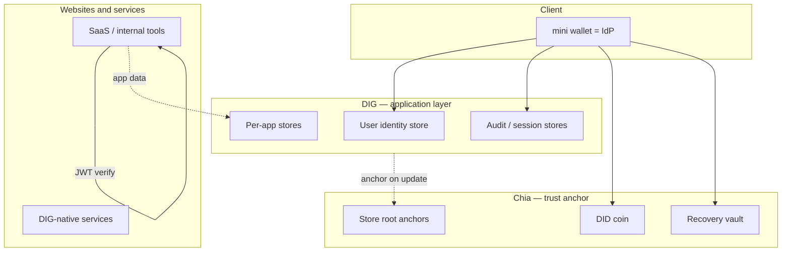

# DIG as the decentralized application layer

> **Principle:** **Chia** anchors trust (DID, vault, store commitments). **DIG** is where decentralized **applications, services, and data** live long term.  
> **MVP priority:** [mvp-strategy.md](../03-use-cases/mvp-strategy.md) — **Step 1** mini wallet + DID + JWT; **Step 2** vault recovery. **DIG-led features are post-MVP**, not Step 1–2 blockers.

**Related:** [fully-decentralized.md](../01-vision/fully-decentralized.md) · [application-architecture.md](application-architecture.md) · [decentralized-verification-no-central-op.md](decentralized-verification-no-central-op.md) · [mini-wallet-and-recovery-vault.md](mini-wallet-and-recovery-vault.md)

---

## Two layers (plus the wallet client)

| Layer | Responsibility | Not used for |
|-------|----------------|--------------|
| **Chia** | DID, `VaultInfo`/Rue recovery, **Merkle root / hash** when a DIG store head changes | Bulk app data, session bodies, HTML |
| **DIG** | **All application state**: profiles, bindings, per-service data, audit, recovery sessions, future PePP | Millisecond OAuth HTTP (still wallet/peer process) |
| **Wallet** | Passkey, sign JWT (IdP), read/write user’s DIG stores, submit Chia txs | Central user DB for the protocol |

---

## What “websites, services, and data on DIG” means

PEGIN does **not** require every shop to abandon SQL on day one. It defines where **user-owned and protocol-native** data should live:

| Data class | Store on DIG | Typical store owner |
|------------|--------------|---------------------|
| Passkey ↔ DID binding | Yes | User identity store |
| Login audit (which RP, when) | Yes | User audit store |
| Recovery sessions, guardian attestations | Yes | Recovery store |
| **App-specific user data** (settings, drafts, game save) | Yes — **per-app DIG store** | App operator peer + user keys |
| **Service config** (feature flags, tenant metadata) | Yes — operator store | Service on DIG peer |
| Public marketing site CDN | Optional / hybrid | Often still CDN; not identity-critical |
| Orders, billing ledgers (company-owned) | Hybrid | Company may keep SQL; **user identity** still PEGIN/DIG |

**Integration model for a normal website:**

1. **Auth:** Login with PEGIN → wallet signs **JWT** (IdP on device).  
2. **Identity:** `sub` / DID in JWT; passkey binding read from **DIG** (wallet or indexer).  
3. **App data:** New integrations write encrypted objects to a **DIG store** scoped to `app_id` + `user_sub` instead of only Postgres.  
4. **Anchor:** On meaningful store updates, commit root on **Chia** so users and auditors can detect tampering.

Legacy sites keep Postgres for commerce; **PEGIN-shaped** sites treat DIG as primary for anything the **user** should own or take with them.

---

## DIG store layout (PEGIN convention)

Proposed store IDs (illustrative — finalize in implementation):

| Store | Contents | Anchored on Chia? |
|-------|----------|-------------------|
| `pegin.identity.{did}` | Passkey credentials, JWT signing key ref, display name | On update |
| `pegin.audit.{did}` | Login events, recovery steps | On update |
| `pegin.recovery.{did}` | Sessions, guardian attestations | On update |
| `app.{app_id}.{user_sub}` | App-owned encrypted payload | Per app policy |
| `service.{service_id}` | Decentralized service metadata | Optional |

**Access control:** user-held keys; apps receive **capabilities** (grant on DIG — PePP Phase 2) instead of blanket API keys to a central DB.

---

## How login fits DIG (wallet IdP)

Sequence:

1. User opens **wallet** (or wallet web origin).  
2. Wallet reads `pegin.identity.*` from **DIG** (local cache + peer).  
3. WebAuthn + optional Chia DID check.  
4. Wallet appends **audit event** to `pegin.audit.*` on DIG.  
5. Wallet signs **JWT** for relying party (`aud`, `exp`).  
6. Website validates JWT; loads **app data** from `app.{app_id}.*` on DIG if integrated.

**No PEGIN Inc. Postgres** for protocol truth. Optional SQL only for **operator** dashboards (Phase 2+), not user identity.

Optional: a **DIG peer** also exposes HTTP OIDC for browsers without the app — same checks, same stores — user picks peer in wallet settings.

---

## Services on DIG network

Decentralized **services** (not just static sites) run as:

- Logic on peer / edge (open binaries)  
- **State and APIs backed by DIG stores** (replicated)  
- Discovery via store metadata or naming (future: slots / handles)

Examples aligned with PEGIN:

| Service | DIG role |
|---------|----------|
| Token issuer (optional peer) | Reads identity + audit stores; writes session notes |
| Guardian email | Recovery store + SMTP/DIG mail |
| Permission approval (PePP) | Grant store + mobile client |
| App backends | `app.*` stores instead of proprietary user tables |

---

## Websites “on DIG” — integration levels

| Level | Website behavior |
|-------|------------------|
| **L0 — JWT only** | OIDC/JWT from wallet; user row in legacy SQL |
| **L1 — identity on DIG** | Reads `pegin.identity` via SDK; SQL only for non-portable data |
| **L2 — app data on DIG** | User content in `app.{id}.{sub}` stores |
| **L3 — anchor discipline** | Every store update batches Chia anchor tx |

PEGIN should **default-document L1→L2** for new apps; L0 is migration path.

---

## Chia vs DIG (when to use which)

| Question | Answer |
|----------|--------|
| Where is the user’s DID? | **Chia** |
| Where is passkey ↔ DID? | **DIG** (anchored) |
| Where is my SaaS user’s saved preferences? | **DIG** (app store) |
| Where is the JWT? | **Transient** — signed by wallet; claims reference DID/`sub` |
| Where is proof the audit log wasn’t tampered? | **Chia** anchor of DIG store head |

---

## MVP scope (honest)

| MVP Step 1–2 | Post-MVP DIG |
|--------------|----------------|
| Wallet-local profile + Chia DID + JWT | `pegin.identity` / `pegin.audit` on DIG |
| Vault + seed + passkey recovery | Per-app `app.*` stores |
| — | Full service mesh, PePP grants on DIG |
| — | Chia anchor on every store update |

Step 1–2 should **not** depend on DIG network features shipping first.

---

## Developer-facing summary

> **Chia** proves identity and store integrity. **DIG** holds the decentralized application — websites, services, and user data. **Wallet** is the IdP and the primary client to both layers. JWT is the thin bridge to today’s web; **DIG is the home for everything that should outlive a single SaaS vendor.**

---

## Related documents

| Doc | Topic |
|-----|--------|
| [dig-enterprise-transformation.md](dig-enterprise-transformation.md) | Enterprise apps on DIG |
| [permission-data-model.md](permission-data-model.md) | PePP on DIG (Phase 2) |
| [tech-stack.md](../04-technical/specs/tech-stack.md) | `dig-l2-storage`, peers |

*DIG application layer v0.1 · May 2026*
