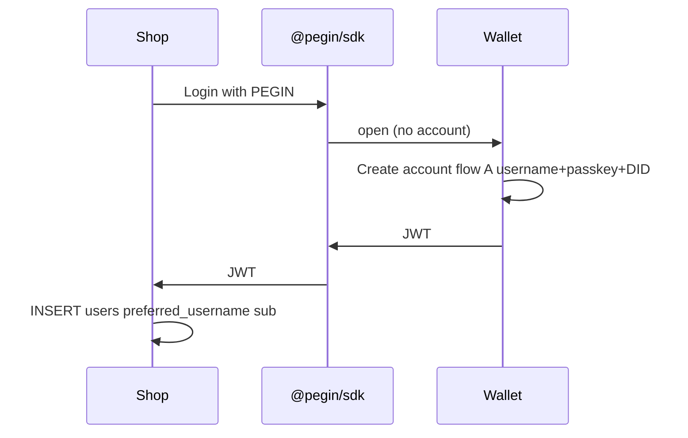

# Identity, username, and account-before-login

> **Idea:** A **DID + username** in the wallet is like your **email address** — created once, used to log in everywhere. **JWT** carries `username` (and stable `sub`). **Account must exist in the wallet before** “Login with PEGIN” on a normal website. Later: **catalog** (XCHandles / CATalog) assigns a unique on-chain name.

**Related:** [mvp-strategy.md](../03-use-cases/mvp-strategy.md) · [existing-apps-and-sso-protocols.md](../08-developer/integration/existing-apps-and-sso-protocols.md) · [mini-wallet-and-recovery-vault.md](mini-wallet-and-recovery-vault.md) · [tech-stack.md](../04-technical/specs/tech-stack.md) § slot-machine / XCHandles

---

## Core rules

| Rule | Meaning |
|------|---------|
| **Account first** | DID (and username) are created in the **wallet**, not on the shop’s signup form |
| **Then login anywhere** | Any site with “Login with PEGIN” receives a JWT for an **existing** wallet identity |
| **Username ≈ email** | One memorable handle (`alice` or `alice.pegin`) — not a hex DID in the UI |
| **JWT includes username** | Sites show `@alice`; developers map `sub` + `preferred_username` to `users` |
| **Multiple DIDs (future)** | Wallet may hold several identities; user picks which DID to use per login |
| **First DID** | MVP: one primary DID per wallet; vault (Step 2) tied to that DID |

---

## Two flows (do not mix)

### A — Create account (wallet only, once per identity)

Happens in **pegin-mini** (or wallet web origin) — **before** or **on first** use of SSO, never as a hidden step inside the shop’s DB.

```
1. Choose username (unique in PEGIN namespace)
2. Passkey (Face ID)
3. Create DID on Chia (+ faucet)
4. (Step 2) Vault + seed backup in settings
5. Profile saved in wallet: { username, did_id, passkey_ids, jwt_pubkey }
```

**Normal websites do not create the DID.** They only consume JWT after the wallet account exists.

### B — Login (any website)

| Session | User sees |
|---------|-----------|
| **JWT / refresh valid** | **Nothing** — already logged in; show `@username` only |
| **Expired, account exists** | One click → Face ID — **no** “wallet” / “PEGIN” modal |
| **No account** | Short create flow (username + Face ID) |

Then: wallet signs JWT (`preferred_username`, `sub`) → site verifies. Detail: [user-facing-ux-principles.md](../02-product/user-facing-ux-principles.md).

If no account → flow **A** once, then silent **B** on return visits.

---

## Username in the wallet

| Field | Storage (MVP) | Purpose |
|-------|---------------|---------|
| `username` | Wallet encrypted profile | Human id like email local-part (`alice`) |
| `did_launcher_id` | Wallet + Chia | Stable cryptographic root |
| `display_name` | Optional | “Alice Smith” in UI |
| `catalog_handle` | **Future** | On-chain name e.g. `alice.pegin` via XCHandles/CATalog |

### Username constraints (product)

- Unique across PEGIN (MVP: wallet/registry service check; future: catalog + slots)
- Charset: `[a-z0-9._-]`, length 3–32 (tune in implementation)
- Case: normalize to lowercase for uniqueness
- Reserved names: `admin`, `pegin`, `www`, …

### Like email

| Email | PEGIN username |
|-------|----------------|
| `alice@gmail.com` | `alice` + DID (portable across providers) |
| Provider owns domain | User owns DID; catalog may own `.pegin` suffix later |
| Login at many sites | Same username in JWT everywhere |

---

## JWT claims (wallet-issued)

Align with [OpenID Connect](https://openid.net/specs/openid-connect-core-1_0.html) standard claim names so sites work with existing libraries.

| Claim | Required | Example | Notes |
|-------|----------|---------|-------|
| `iss` | Yes | `did:chia:…` or `https://wallet.pegin` | Issuer |
| `sub` | Yes | `pegin:usr:abc123` | Stable; map to DB primary key |
| `aud` | Yes | `client_id` of relying party | |
| `exp` / `iat` | Yes | unix time | Session lifetime |
| **`preferred_username`** | **Yes (MVP)** | `alice` | **Primary handle for UI** |
| `name` | Optional | `Alice` | Display |
| `pegin_did` | Recommended | `did:chia:…` | For audit / future on-chain apps |
| `pegin_catalog` | Future | `alice.pegin` | After catalog registration |

Example payload:

```json
{
  "iss": "did:chia:launcher_id…",
  "sub": "pegin:usr:8f3a2b1c",
  "aud": "my-saas-client-id",
  "exp": 1716307200,
  "iat": 1716303600,
  "preferred_username": "alice",
  "name": "Alice",
  "pegin_did": "did:chia:…"
}
```

**Websites:** use `preferred_username` for “Logged in as @alice”; use `sub` for database foreign key (immutable even if catalog handle changes).

---

## Normal website integration

### First-time visitor on a shop (no PEGIN account yet)



### Returning user

Wallet → passkey → JWT with same `sub` + `preferred_username` → site finds existing row.

### Linking legacy email user (optional)

Logged-in shop user → “Link PEGIN” → wallet returns JWT → `UPDATE users SET pegin_sub=?, pegin_username=?`.

---

## Multiple DIDs (future)

| MVP | Future |
|-----|--------|
| One DID + one username per wallet | Wallet list: Work / Personal / … |
| JWT from that DID only | Login UI: “Continue as @alice (personal)” |
| One vault per DID (Step 2) | Each DID has own vault |

Each DID can be used as login; each has its own **username** (and optional catalog handle).

---

## Catalog — unique on-chain name (future)

MVP uses **wallet-registered username** (off-chain or peer registry). **Later** integrate [XCHandles](https://docs.xchandles.com/) / [CATalog](https://docs.catalog.cat/) / [slot-machine](https://github.com/Yakuhito/slot-machine) for a **global unique** name (e.g. `alice.pegin`).

| Phase | Naming |
|-------|--------|
| **MVP Step 1** | `preferred_username` in JWT; uniqueness via PEGIN registry in wallet |
| **Post-MVP** | Register handle on-chain; add `pegin_catalog` claim to JWT |
| **Sites** | Show `@alice` or `alice.pegin` — never raw launcher id |

Catalog registration is **after** DID exists (same as “verify domain after you own email”).

---

## Order vs vault (Step 1 vs 2)

| Step | Created in wallet |
|------|-------------------|
| **1** | Username + passkey + **DID** → can issue JWT → **login on websites** |
| **2** | **Vault** + seed → recover DID / multi-device |

**First vault/DID must exist before SSO** — vault is not required for **first** login in Step 1; vault is required for **recovery** in Step 2. Wording: *account (DID + username) before site login; vault before lose-your-device recovery.*

---

## Developer checklist

| Task | Owner |
|------|--------|
| Wallet: username uniqueness check | `pegin-wallet` |
| Wallet: store profile with username + did | `pegin-mini` |
| JWT: always set `preferred_username` + `sub` | `pegin-wallet` |
| SDK: if no account, run create flow then login | `@pegin/sdk` |
| Site: `users.pegin_sub`, `users.pegin_username` columns | App team |
| Future: catalog register + `pegin_catalog` claim | Post-MVP |

---

## Related documents

| Doc | Topic |
|-----|--------|
| [login-with-pegin-vs-social-idp.md](../02-product/login-with-pegin-vs-social-idp.md) | Apple-like UX |
| [recovery-vault-and-guardians.md](recovery-vault-and-guardians.md) | Step 2 vault |

*Identity & username v0.1 · May 2026*
