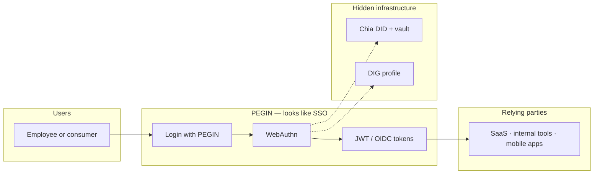
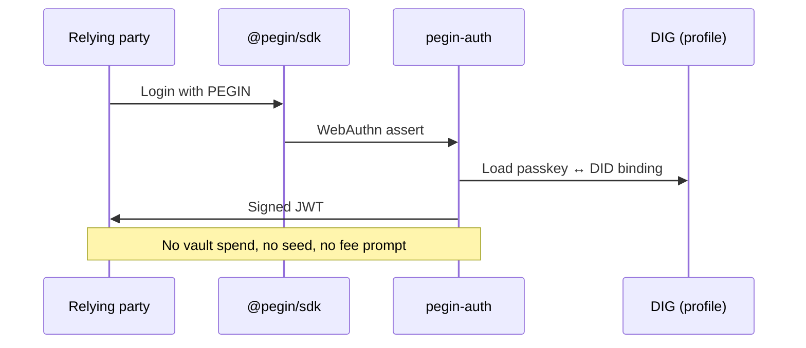
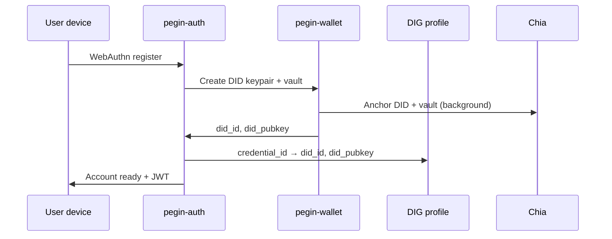

# Mini wallet + recovery vault (POC prototype)

> **North star:** One thing done perfectly — **decentralized SSO login** that feels instant.  
> **MVP order:** [mvp-strategy.md](../03-use-cases/mvp-strategy.md) — **Step 1:** wallet + DID + JWT. **Step 2:** vault + seed/passkey recovery. DIG not Step 1.

**Related:** [recovery-vault-and-guardians.md](recovery-vault-and-guardians.md) · [mvp-strategy.md](../03-use-cases/mvp-strategy.md) · [tech-stack.md](../04-technical/specs/tech-stack.md) · [on-chain-architecture.md](on-chain-architecture.md) · [products/vault-architecture.md](products/vault-architecture.md) (full Penguin Vault — **not** POC scope)

---

## Design motto

| Path | User experience | On-chain |
|------|-----------------|----------|
| **Login (every day)** | Button → Face ID / passkey → logged in | Verify DID + passkey binding; issue JWT |
| **Create account (once)** | Same biometrics; “Account ready” in ~3s | Create DID + recovery vault; faucet funds fees |
| **Recovery (rare)** | Explicit flow; multiple keys; timelock | Spend recovery vault; rotate DID |

**Not in the login path:** seed phrases, vault unlock, multi-step wallet setup, or “which key do you want?”

---

## Blockchain invisible (non-negotiable UX)

Chia, DID coins, vaults, faucets, and DIG are **implementation**. End users and most IT admins should never need to understand them.

| Who | What they see | What they never see (POC) |
|-----|---------------|---------------------------|
| **End user** | “Login with PEGIN” → Face ID / fingerprint → logged in | Chia, XCH, wallet, seed phrase, tx fees, testnet |
| **App developer** | OIDC client + `@pegin/sdk` button (same as “Sign in with Google”) | Running a node, funding users, CLVM |
| **Company / IdP buyer** | Standard SSO integration checklist, FIDO2 posture | Blockchain ops as a day-one requirement |

**Language rule:** No “wallet,” “coin,” “on-chain,” or “blockchain” in user-facing copy. Use **account**, **sign in**, **verify with Face ID** — same vocabulary as Apple, Google, or Okta passkey flows.

**Engineering rule:** `pegin-wallet` and Rue run **server-side or in a thin client**; the browser only does WebAuthn. Users do not install Sage or manage keys to log into a SaaS app.

**Recovery exception:** Optional advanced settings may mention “backup” or “security key” — still not “Chia vault” or “DID coin.”

---

## Two audiences, one login button

PEGIN is one product surface for **consumers** and **companies that want SSO** — not a crypto app and a separate enterprise SKU at POC.

### End users (consumers, employees, citizens)

- Same flow as familiar passkey login: one button, biometrics, done.
- Works on personal devices without a crypto background.
- Identity stays portable (user-held DID under the hood); UX does not preach decentralization at login time.

### Companies (SaaS, startups, enterprises evaluating SSO)

- Integrate like any **identity provider**: register OIDC client, redirect URIs, JWKS, scopes ([enterprise-identity-spec.md](../04-technical/specs/enterprise-identity-spec.md) phased).
- Security story leads with **FIDO2 / WebAuthn** and signed tokens — what security teams already approve — not “we put login on a blockchain.”
- Optional self-host or managed PEGIN; Chia/DIG are **verifiable infrastructure** for auditors and architects, not onboarding homework for every employee.
- Later: SAML bridge, SCIM, Entra federation — **same passkey UX for users**; admins use familiar IdP tooling.



**POC proof for companies:** One demo app + OIDC discovery proves “drop-in SSO” without asking the customer to run a Chia node.

---

## First MVP = mini wallet

The **first shippable product** is a **mini wallet** — a small Rust core (`pegin-wallet`) that:

- Runs **everywhere** the SSO client runs: Tauri shell (desktop/mobile), embedded in the PEGIN service, later WASM where needed
- Uses **[chia-wallet-sdk](https://github.com/xch-dev/chia-wallet-sdk)** for DID coins, spends, and transaction building
- Uses **[chia-wallet-sdk](https://github.com/xch-dev/chia-wallet-sdk) `VaultInfo`** + **[Rue](https://github.com/xch-dev/rue)** vault puzzles maintained upstream by **[Rigidity](https://github.com/Rigidity)** — PEGIN composes, does not fork custody CLVM (see [recovery-vault-and-guardians.md](recovery-vault-and-guardians.md))
- Stays **fast**: no full-node sync on the user device for POC; the service or a light gateway submits and confirms txs

**Reference UI shell:** [Sage](https://github.com/xch-dev/sage) (Rust + Tauri v2 + React) — copy the *layout*, not the full wallet feature set.

```
┌─────────────────────────────────────────────────────────────┐
│  pegin-mini (Tauri / browser host)                          │
│  ┌─────────────┐  ┌──────────────┐  ┌─────────────────────┐ │
│  │ @pegin/sdk  │  │ pegin-wallet │  │ pegin-auth (Axum)   │ │
│  │ WebAuthn UI │  │ chia-wallet- │  │ JWT · OIDC · faucet │ │
│  │             │  │ sdk + Rue    │  │                     │ │
│  └─────────────┘  └──────────────┘  └─────────────────────┘ │
└─────────────────────────────────────────────────────────────┘
         │ passkey              │ DID + vault spends
         ▼                      ▼
   FIDO2 credential      Chia testnet (DID standard)
                         + 1 recovery vault / wallet
```

---

## One wallet → one recovery vault → one DID

| Object | Count per user | Role |
|--------|----------------|------|
| **PEGIN identity (login)** | 1 passkey (WebAuthn) | Daily authentication; bound to DID in DIG profile |
| **DID coin** | 1 | W3C / Chia DID standard anchor (`DidInfo` via chia-wallet-sdk) |
| **Recovery vault** | 1 | SDK `VaultInfo` singleton; custody of DID for **recovery only** |

The recovery vault is **not** a general-purpose credential safe in POC. It exists so the DID can be recovered if the passkey is lost — without making seed phrases part of signup.

**Defer to later:** Level-2 app vaults, enterprise master vault, ZK credential vaults ([vault-architecture.md](products/vault-architecture.md)).

### Recovery (summary)

| Method | Role |
|--------|------|
| **[Chia Signer](recovery-vault-and-guardians.md#recovery-path-a--chia-signer-hardware--sage-class)** | Hardware / secure-enclave **custody share**; co-signs vault recovery |
| **[Email guardian](recovery-vault-and-guardians.md#recovery-path-b--decentralized-email-guardian)** | Decentralized delivery + guardian attestation on DIG; **not** sole on-chain key |
| **Seed phrase share** | Optional backup share; shown once in settings, never at login |

Rules: **m-of-n always**, **timelock**, **passkey not in vault**. Full flows: [recovery-vault-and-guardians.md](recovery-vault-and-guardians.md).

---

## Login flow (target &lt; 1s perceived)



### Instant login — how it works (no chain round-trip)

**Rule:** Daily login must **not** read Chia or spend the vault. Chain is for **anchor + recovery**, not per-click auth.

| Step | Where | Time |
|------|--------|------|
| 1. User clicks Login | Browser / app | — |
| 2. **WebAuthn assert** | Device Secure Enclave | ~100–400 ms |
| 3. Server verifies FIDO2 signature | `pegin-auth` | ~1–20 ms |
| 4. Lookup **credential id → DID** | DIG (local cache / peer) | ~1–50 ms |
| 5. Issue **JWT** or OIDC tokens | `pegin-auth` | ~1–10 ms |
| 6. App validates JWT | Relying party (JWKS) | ~1–10 ms |

**Total perceived:** sub-second if DIG profile is warm-cached on the auth node.

**What proves identity at login:** the **passkey** (FIDO2), not a DID private key signature. The DID is the **stable subject id** (`sub` claim); the passkey is the **live authenticator**.

### Two key types (do not conflate)

| Key | Algorithm / home | Used for |
|-----|------------------|----------|
| **Passkey** | P-256 / ECDSA in platform authenticator | Every login (WebAuthn) |
| **DID key** | Chia **BLS** (typical for `DidInfo`) | DID updates, on-chain spends, optional high-assurance proofs |

A passkey private key **does not** mathematically “equal” the DID private key. Linking them is a **registration-time binding** stored in DIG (and optionally anchored on chain once), not curve magic.

### Can the DID private key verify the DID public key in the vault?

**Yes — that is standard BLS signature verification** — but it is **not** the default login path.

1. Read the **authorized pubkey(s)** from the **DID coin state** (inner puzzle / `DidInfo`). That is the source of truth for “who controls this DID.”
2. The **vault** (`VaultInfo`) adds **custody rules** on recovery/update paths (m-of-n, timelock). It does not replace the DID’s own inner key checks.
3. If you hold the **DID secret key**, sign an arbitrary challenge `m`, then check  
   `verify(signature, m, pubkey_from_did_coin)` using `chia-bls` (or SDK helpers).
4. If that passes, you have proved control of the same pubkey the chain attributes to that DID — including when that DID coin is under vault custody.

So: **you verify pubkey against your DID sk**, where the pubkey is read from **on-chain DID state** (or a trusted cache/indexer). The vault commits to **who may spend/recover** the DID coin, not a separate unrelated pubkey.

**At login you usually do not do step 3** because:

- The user’s phone does not hold the BLS DID key (only the passkey).
- On-chain read + BLS sign would add hundreds of ms to seconds.
- WebAuthn already gives phishing-resistant auth for SSO.

**When DID-key verification *does* make sense:**

| Moment | Use |
|--------|-----|
| **Registration** | `pegin-wallet` creates DID; record `did_launcher_id` + `did_pubkey` in DIG next to passkey credential id |
| **Background health check** | Indexer compares DIG cached pubkey vs current DID coin; revoke sessions if drift |
| **Recovery complete** | New DID keys after vault spend; re-bind passkey |
| **Optional “high assurance” mode** | Chia Signer signs challenge with DID key (power users / admins) |

### Registration binding (one-time, can be async)



After this, login only needs steps 2–5 in the first table.

### What companies verify (SSO)

Relying parties **never** touch Chia at login. They validate **OIDC/JWT** from PEGIN (JWKS, `iss`, `aud`, `exp`, `sub` = DID). Decentralization shows up in **subject stability** and optional **offline DID proof** later — not in employee-facing latency.

### Security properties (instant path)

| Property | Mechanism |
|----------|-----------|
| Phishing-resistant auth | WebAuthn / FIDO2 |
| Stable user id | DID (`sub`) |
| Vendor cannot forge login | FIDO2 verifies origin; JWT signed by PEGIN OP keys |
| Chain alignment (eventual) | Background DID state vs DIG cache; recovery uses vault + DID keys |

---

## Account creation (target ~3s perceived)

Users should see **“Account created”** in about **3 seconds**. That requires **optimistic UX** plus infrastructure:

| Technique | Why |
|-----------|-----|
| **Optimistic ready** | Issue session/JWT as soon as passkey registration + local wallet state succeed |
| **Background chain** | DID + vault creation txs submitted asynchronously; UI shows confirm later |
| **No local full node** | POC uses PEGIN service + testnet RPC / simulator for submits |
| **Faucet** | `pegin-faucet` (operator) funds first txs — user never buys XCH for signup |

### Faucet (testnet POC)

| Piece | Implementation |
|-------|------------------|
| **Sponsor wallet** | Operator-held testnet XCH |
| **`POST /faucet/fund`** | Rate-limited; ties to device/session id before DID exists |
| **Dev / CI** | [chia-sdk-test](https://docs.rs/chia-sdk-test) simulator — no public faucet |

Production: faucet goes away or becomes “sponsor credits” inside managed hosting — not user-facing on mainnet.

---

## Repositories to fork or depend on (prototype)

### Must-have (Rust / Chia)

| Repository | Role in prototype |
|------------|-------------------|
| [xch-dev/chia-wallet-sdk](https://github.com/xch-dev/chia-wallet-sdk) | DID create/update/spend, `SpendContext`, tests |
| [xch-dev/rue](https://github.com/xch-dev/rue) | Vault puzzles (Rigidity upstream); thin PEGIN extensions only |
| [Rigidity](https://github.com/Rigidity) / chia-wallet-sdk | `VaultInfo`, custody hash, vault spends |
| [Chia-Network/chia_rs](https://github.com/Chia-Network/chia_rs) | Protocol types (transitive) |
| [xch-dev/sage](https://github.com/xch-dev/sage) | Tauri + React shell reference |
| `passkey` crate (1Password) | WebAuthn server in `pegin-auth` |

### Strongly recommended

| Repository | Role |
|------------|------|
| [chia-sdk-test](https://github.com/xch-dev/chia-wallet-sdk) (crate) | Unit/integration tests without testnet |
| [DIG-Network/dig-l2-storage](https://github.com/DIG-Network/dig-l2-storage) | Passkey↔DID profile, session store |
| [docs.chia.net — DIDs](https://docs.chia.net/academy-did) | DID standard alignment |
| [Chia-Network/chips](https://github.com/Chia-Network/chips) | DID / VC CHIPs |

### Phase 1+ (not blocking 3s login POC)

| Repository | Role |
|------------|------|
| [Yakuhito/slot-machine](https://github.com/Yakuhito/slot-machine) | `alice.pegin` naming |
| [xch-dev/sage-dapp-example](https://github.com/xch-dev/sage-dapp-example) | WalletConnect patterns |
| Full [vault-architecture](products/vault-architecture.md) stack | Enterprise custody product |

---

## Planned crates (prototype workspace)

| Crate / package | Stack | POC responsibility |
|-----------------|-------|---------------------|
| `pegin-wallet` | Rust, chia-wallet-sdk | Mini wallet: DID + vault txs, key material API |
| `pegin-contracts` | Rue | Gaps only; vault+DID from SDK upstream |
| `pegin-auth` | Rust, Axum, passkey | WebAuthn, JWT, OIDC, faucet client |
| `pegin-faucet` | Rust (or module in auth) | Testnet sponsorship |
| `pegin-mini` | Tauri v2 + React | Host app; instant open |
| `@pegin/sdk` | TypeScript | Login button + WebAuthn in browser |

---

## Tech stack summary (prototype)

| Layer | Choice | Notes |
|-------|--------|-------|
| Wallet core | Rust + chia-wallet-sdk | Shared library, not a Sage clone |
| Contracts | Rue → CLVM via SDK | Vault custody (upstream) + PEGIN binding if needed |
| Login | WebAuthn / FIDO2 (`passkey` crate) | Face ID, Touch ID, Windows Hello |
| API | Axum 0.8 | Auth, faucet, OIDC discovery |
| Client shell | Tauri v2 + React + Shadcn | Same pattern as Sage |
| Browser SDK | `@simplewebauthn/*` | Relying-party integration |
| Off-chain profile | DIG (`dig-l2-storage`) | Minimal: passkey credential id → DID |
| Tests | chia-sdk-test + simulator | Before testnet11 in CI |
| Chain | Chia testnet11 | Real faucet optional weekly |

---

## What we explicitly do not build in POC

- Full Penguin Vault (tiers, custody APIs, KYC biometrics)
- PePP permissions platform
- SAML / SCIM / Entra
- User-visible seed phrase at signup
- Per-app child vaults
- Mainnet production SLA

---

## Success metrics (update from legacy 5s target)

| Metric | Target |
|--------|--------|
| Login (p99 perceived) | &lt; 1s |
| Account created (perceived) | ~3s |
| Passkey register + DID + vault (background) | &lt; 30s on testnet |
| User steps at signup | 1 biometric ceremony |

---

## Open items (track upstream)

| Item | Direction |
|------|-----------|
| **Vault coin layout** | Follow Rigidity’s `VaultInfo` + Rue custody puzzle in chia-wallet-sdk releases |
| **Hosted submitter** | POC: PEGIN submits txs; document user-held signing path for v1 |
| **JWT vs. OIDC** | Both; companies use OIDC ([mvp-strategy.md](../03-use-cases/mvp-strategy.md)) |

Email guardian + Chia Signer flows: [recovery-vault-and-guardians.md](recovery-vault-and-guardians.md).

*Mini wallet architecture v0.2 · May 2026 · Vault structure composes chia-wallet-sdk upstream.*
