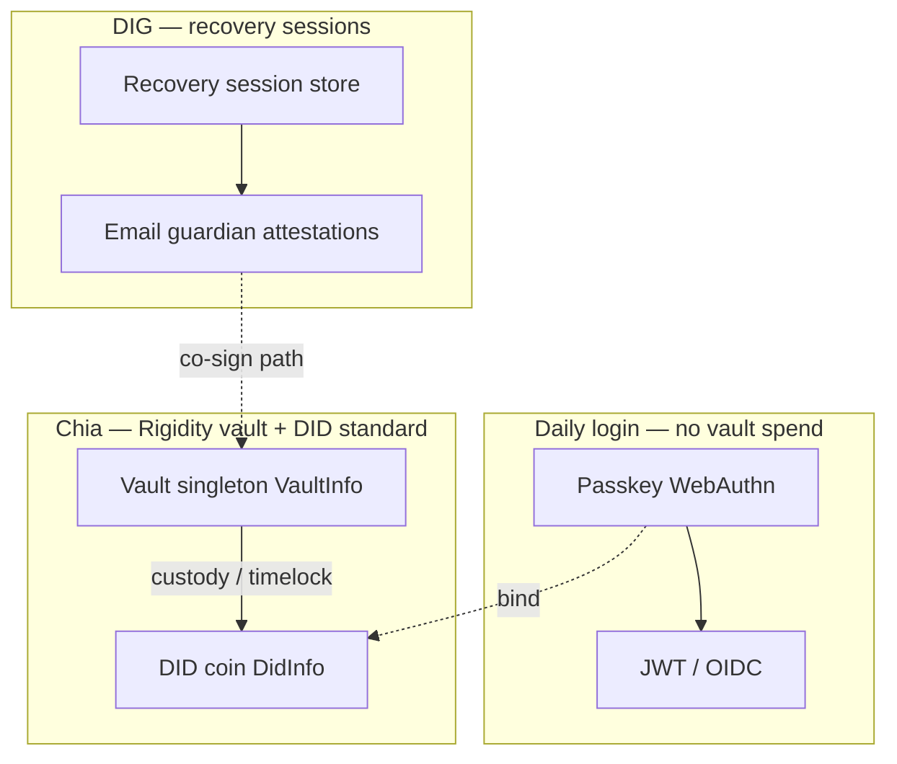
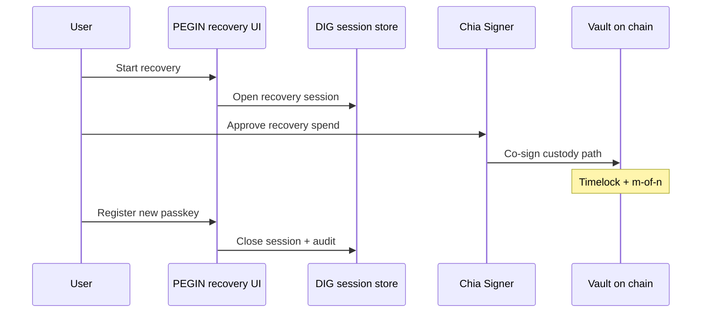
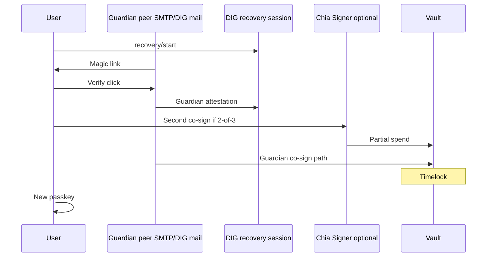

# Recovery vault, email guardian, and Chia Signer

> **Upstream coin structure:** [Rigidity](https://github.com/Rigidity) (Brandon Haggstrom) maintains **Rue vault puzzles** and **`VaultInfo`** in [xch-dev/chia-wallet-sdk](https://github.com/xch-dev/chia-wallet-sdk) / [xch-dev/rue](https://github.com/xch-dev/rue). PEGIN should **compose** that work, not reinvent custody puzzles.

**Related:** [mini-wallet-and-recovery-vault.md](mini-wallet-and-recovery-vault.md) · [fully-decentralized.md](../01-vision/fully-decentralized.md) §5 · [tech-stack.md](../04-technical/specs/tech-stack.md)

---

## Upstream: Rigidity + chia-wallet-sdk vault primitive

| Piece | Source | PEGIN use |
|-------|--------|-----------|
| **Rue vault puzzle** | `rue` / `chia-sdk-driver` (upstream) | Recovery singleton + custody rules |
| **`VaultInfo`** | `chia-wallet-sdk` prelude | `launcher_id` + `custody_hash` — singleton layer for vault coin |
| **`DidInfo`** | same SDK | DID coin beside / under vault custody model |
| **`SpendContext`** | wallet SDK | Build recovery spends in `pegin-wallet` |
| **`rue-compiler`** | pinned in chia-wallet-sdk workspace | Align compiler version with SDK releases |

```rust
// Conceptual — see docs.rs VaultInfo (pin SDK version from releases)
// VaultInfo { launcher_id, custody_hash } implements SingletonInfo
```

### Integration policy

1. **Track upstream** — Pin `chia-wallet-sdk` to releases that include vault + DID drivers; watch [chia-wallet-sdk releases](https://github.com/xch-dev/chia-wallet-sdk/releases) and Rigidity’s `rue` changes.
2. **Thin `pegin-contracts`** — Only Rue/Chialisp **gaps** PEGIN needs (e.g. DID ↔ vault binding policy), not a second vault standard.
3. **`pegin-wallet`** — Wrap `VaultInfo` + `DidInfo` creation, recovery spend bundling, and simulator tests via `chia-sdk-test`.
4. **Coin layout** — Follow upstream’s custody hash / inner puzzle design once published; document PEGIN’s **1 DID : 1 recovery vault** mapping on top.

> **Note:** User-facing name remains **recovery vault**; implementation name follows SDK (`VaultInfo`, custody puzzle).

---

## Vault custody model (PEGIN mapping)



| Rule | Detail |
|------|--------|
| **Multi-key always** | On-chain recovery requires **m-of-n** custody pubkeys (e.g. 2-of-3). Email alone is never sufficient. |
| **Passkey ∉ vault** | Passkey authenticates login; after recovery, user registers a **new** passkey bound to rotated DID. |
| **Timelock** | Recovery spend path enforces delay (e.g. 24–48h); active passkey or Chia Signer co-signer can **cancel** during window. |
| **DID in vault** | DID coin recovery goes through vault custody puzzle (upstream structure), not ad-hoc PEGIN CLVM. |

---

## Recovery path A — Chia Signer (hardware / Sage-class)

**User-facing copy:** “Recover with security key” or “Chia Signer” — not “vault coin” or “seed.”

### What Chia Signer provides

| Property | Role in recovery |
|----------|------------------|
| **Secure enclave / hardware** | One **custody pubkey** in the m-of-n set |
| **User-held signing** | Co-signs recovery spend; PEGIN operator never holds this key |
| **Sage / Signer app UX** | Familiar to Chia users; optional for PEGIN users at setup |

### Flow

1. User loses passkey → opens recovery UI → chooses **Chia Signer**.
2. PEGIN creates **DIG recovery session** (nonce, expiry, intended action).
3. Signer app displays vault recovery request → user approves with biometrics/PIN on device.
4. Signer provides **partial signature** or pubkey proof per SDK vault spend API.
5. If policy is 2-of-3, **second factor** required (e.g. email guardian attestation or seed phrase share).
6. Timelock elapses (unless cancelled) → vault spend rotates DID / updates custody → user registers **new passkey**.



### Engineering

- Integrate via **chia-wallet-sdk** signer / Sage Connect patterns ([sage-dapp-example](https://github.com/xch-dev/sage-dapp-example)) when ready.
- POC: simulator + test signer; production: real Signer deep link or WC-style pairing.
- **No seed phrase at signup** — Signer is opt-in recovery share, configured in settings after account exists.

---

## Recovery path B — Decentralized email guardian

Email is **delivery + guardian attestation**, not a single-factor on-chain key.

### Design goals

| Goal | How |
|------|-----|
| **Decentralized** | No mandatory `recovery@pegin.com`; any DIG peer (or self-host) can run guardian **delivery** |
| **Not surveillance SSO** | Recovery inbox is user-chosen (Proton, Tutanota, etc.) — see [fully-decentralized.md](../01-vision/fully-decentralized.md) §5 |
| **Honest security** | Email proves **reachability**; vault still needs **other custody shares** + timelock |
| **Blockchain invisible** | User sees “confirm recovery email,” not “guardian pubkey” |

### Two layers (do not merge)

| Layer | Responsibility | Decentralization |
|-------|----------------|------------------|
| **Delivery** | Send magic link / OTP to user’s recovery address | Federated SMTP now; [DIG Recovery Mail](fully-decentralized.md#52-phase-2--dig-federated-email-recovery) later |
| **Authorization** | Map verified email → **guardian pubkey** co-signing vault path | Guardian pubkey registered at setup; attestation stored on **DIG** |

### Guardian pubkey model

At account setup (optional, advanced):

1. User supplies recovery email (privacy-first provider encouraged).
2. PEGIN (or user client) derives or registers **`guardian_email_pubkey`** — a dedicated keypair **not** controlled by PEGIN Inc.
3. Pubkey is one share in vault **m-of-n** (e.g. 2-of-3 with Chia Signer + seed phrase share).
4. DIG store records: `recovery_email_hash`, `guardian_pubkey`, provider hint — encrypted.

**Operator rule:** PEGIN company SHOULD NOT be the sole guardian for all users in production; offer **self-host guardian**, **community DIG peer**, or **bring-your-own SMTP + guardian service** for enterprises.

### Recovery flow (email guardian)

1. User initiates recovery → DIG **recovery session** (`session_id`, `exp`, `device_hint`).
2. Guardian service (any peer) sends **time-limited link** to recovery email (SMTP or DIG mail).
3. User clicks link → proves possession → guardian service signs **attestation**:
   - `session_id`, `guardian_pubkey`, `timestamp`, signature
4. Attestation appended to DIG session; visible to co-signers.
5. Second share: **Chia Signer** or **seed phrase share** (per policy).
6. Vault recovery spend submitted via `pegin-wallet` + SDK; **timelock** starts.
7. User can **cancel** with active passkey (if any device left) or Chia Signer during timelock.
8. After timelock → DID rotation → new passkey registration.



### Anti-patterns (reject)

| Anti-pattern | Why |
|--------------|-----|
| Email as **only** on-chain key | Phishing + provider compromise = full account loss |
| Central `recovery@pegin.com` only | Single operator betrayal |
| Security questions | Weak vs passkey + guardian |
| Showing seed at signup | Violates chain-invisible UX |

### Phase 2 — DIG federated email

Same authorization model; delivery moves to **DIG Recovery Mail** spec ([fully-decentralized.md §5.2](../01-vision/fully-decentralized.md#52-phase-2--dig-federated-email-recovery)). SMTP remains fallback.

---

## Suggested default custody policies (POC → v1)

| Profile | m-of-n | Shares | Notes |
|---------|--------|--------|-------|
| **MVP Step 2** | 2-of-3 | **Seed phrase** + **phone passkey** + **optional desktop passkey** | Daily login: QR/passkey — **not seed** — [cross-device-login-and-vault-recovery.md](cross-device-login-and-vault-recovery.md) |
| **Later** | 2-of-3 | Seed + Chia Signer + email guardian | Post-MVP |
| **Enterprise** | 3-of-5 | Signer + IT + email + HSM + break-glass | Phase 1+ |

Step 2 simulator: **MVP** profile first.

---

## DIG recovery session (minimal schema)

```json
{
  "session_id": "uuid",
  "did_id": "launcher_or_did_ref",
  "state": "requested | email_verified | cosigned | timelock | completed | cancelled",
  "exp": "ISO-8601",
  "attestations": [
    { "type": "email_guardian", "pubkey": "...", "sig": "...", "at": "..." },
    { "type": "chia_signer", "pubkey": "...", "sig": "...", "at": "..." }
  ],
  "vault_launcher_id": "bytes32"
}
```

Anchor session head on Chia when store updates (same audit pattern as PePP).

---

## Implementation checklist

| Step | Owner |
|------|--------|
| Pin `chia-wallet-sdk` with `VaultInfo` + vault spends | `pegin-wallet` |
| Align `rue` / `rue-compiler` version with SDK workspace | `pegin-contracts` |
| Simulator: 2-of-3 recovery with test keys | `chia-sdk-test` |
| DIG recovery session CRUD | `pegin-infrastructure` |
| Guardian SMTP adapter (pluggable peer) | `pegin-auth` recovery module |
| Chia Signer co-sign API (stub → Sage) | `pegin-mini` + SDK |
| User copy audit (no “blockchain” words) | Design / SDK strings |

---

## Related documents

| Doc | Topic |
|-----|--------|
| [mini-wallet-and-recovery-vault.md](mini-wallet-and-recovery-vault.md) | POC scope, faucet, instant login |
| [fully-decentralized.md](../01-vision/fully-decentralized.md) | Federated email phases |
| [on-chain-architecture.md](on-chain-architecture.md) | DID + contract overview |
| [tech-stack.md](../04-technical/specs/tech-stack.md) | Dependencies and pins |

*Recovery architecture v0.2 · May 2026 · Composes Rigidity upstream vault + PEGIN guardian orchestration.*
